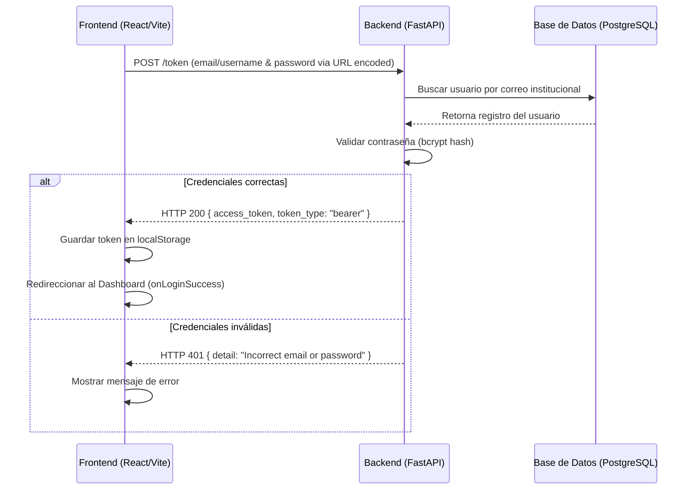

# Análisis Técnico: Autenticación y Gestión de Usuarios

Este documento presenta un desglose detallado de la arquitectura de autenticación (Login) y gestión de identidades en el proyecto **Maestría: Sistema Integral de Planificación Estratégica (DIDACTICO)**. Adicionalmente, se incluyen propuestas técnicas orientadas a robustecer el sistema en términos de seguridad, experiencia de usuario y control operativo.

---

## 1. Estructura y Flujo del Módulo de Login 🔐

El sistema utiliza un esquema de autenticación basado en **tokens JWT (JSON Web Tokens)** alineado al estándar **OAuth2** (utilizando la contraseña e identificador en formato `application/x-www-form-urlencoded`).

### 🔹 Componente Frontend: [Login.tsx](file:///c:/WEBS/AI-PROYECTS/PROYECTO-MAESTRIA-PY/sys-plan/src/components/Login.tsx)
*   **Manejo de Estado:** Administra mediante `useState` variables reactivas para los campos `email` y `password`, visibilidad de caracteres (`showPassword`), cargando (`isLoading`) y errores (`error`).
*   **Transmisión de Datos:** Codifica los parámetros usando `URLSearchParams` para transmitir las credenciales con el tipo de contenido `application/x-www-form-urlencoded`, cumpliendo con la especificación estándar de FastAPI.
*   **Persistencia:** Tras obtener una respuesta HTTP exitosa (200 OK), guarda el token JWT en el almacén persistente del navegador (`localStorage.setItem('token', data.access_token)`) e invoca la rutina `onLoginSuccess()`.
*   **Interfaz de Usuario:** Cuenta con un diseño responsivo en pantalla dividida en dispositivos de escritorio, enriquecido con difuminados decorativos y un panel de marca institucional.

### 🔸 Componente Backend: [auth.py](file:///c:/WEBS/AI-PROYECTS/PROYECTO-MAESTRIA-PY/sys-core/api/routers/auth.py)
*   **Endpoint (`POST /token`):** Expone la ruta que captura las credenciales del formulario mediante el inyector de dependencias `OAuth2PasswordRequestForm`.
*   **Validación e Integridad:**
    1.  Consulta la base de datos de manera asíncrona mediante el motor SQLAlchemy para identificar al usuario por su correo electrónico (`User.email == form_data.username`).
    2.  Verifica las contraseñas comparando el hash almacenado con el valor plano provisto, valiéndose de la función de encriptación `verify_password` de `api.core.security` (soporte basado en bcrypt).
*   **Firma del Token:** Construye el token JWT empaquetando el correo (`sub`) y el rol (`role`) del usuario en el payload, asignándole una clave secreta y un tiempo de expiración determinado.

---

## 2. Estructura de la Creación y Gestión de Usuarios 👥

La administración y control de identidades se encuentra restringida bajo políticas estrictas de control de acceso para asegurar que únicamente los administradores del sistema interactúen con ella.

### 🔹 Componentes Frontend: [UserManagement.tsx](file:///c:/WEBS/AI-PROYECTS/PROYECTO-MAESTRIA-PY/sys-plan/src/components/UserManagement.tsx) y [UserModal.tsx](file:///c:/WEBS/AI-PROYECTS/PROYECTO-MAESTRIA-PY/sys-plan/src/components/UserModal.tsx)
*   **Estructura del Listado:** `UserManagement` emplea `@tanstack/react-table` para proveer una grilla reactiva y fluida para la visualización de los datos. Administra las llamadas y el almacenamiento de caché en el cliente con `@tanstack/react-query` (`useQuery(['users'])`).
*   **Esquema de Validación:** El formulario contenido en `UserModal` opera bajo `react-hook-form` acoplado al validador de esquemas `zod`. El comportamiento del esquema se adapta de forma inteligente:
    *   **Modo Creación:** Demanda obligatoriamente una clave inicial no vacía (mínimo de 6 caracteres).
    *   **Modo Edición:** Permite dejar la clave vacía en caso de que no se requiera alterar ese campo en la base de datos.
*   **Mutación de Datos:** Consume los endpoints mediante llamadas asíncronas con Axios, utilizando `useMutation` para coordinar de manera transparente la actualización visual (invalidando la query `'users'`) ante operaciones de creación (`POST /users`), edición (`PUT /users/{id}`) o eliminación lógica (`DELETE /users/{id}`).

### 🔸 Componente Backend: [users.py](file:///c:/WEBS/AI-PROYECTS/PROYECTO-MAESTRIA-PY/sys-core/api/routers/users.py)
*   **Control de Accesos (RBAC):** Protege todos sus recursos mediante la directiva `check_role(current_user, [UserRole.SUPER_ADMIN])`, denegando solicitudes de usuarios con roles de Docente o Coordinador.
*   **Lógica de Operaciones:**
    1.  **Listar (`GET`):** Retorna la totalidad de registros persistidos en la tabla de usuarios.
    2.  **Crear (`POST`):** Revalida que el correo electrónico no exista previamente en la base de datos. Encripta la contraseña e inicializa al usuario con la propiedad `is_active=True`.
    3.  **Actualizar (`PUT`):** Permite actualizaciones parciales. Si se incluye una contraseña nueva, procede a hashearla antes de guardarla.
    4.  **Inactivar (`DELETE`):** Realiza un **Borrado Lógico** marcando la columna `is_active` como `False`. Cuenta con una salvaguarda esencial para evitar el bloqueo del sistema impidiendo que un administrador se desactive a sí mismo.

---

## 3. Propuestas de Mejoras e Incorporaciones Técnicas 🚀

Con el fin de elevar la robustez de la plataforma a estándares de producción, se sugiere priorizar la implementación de las siguientes características organizadas por categorías:

### A. Mejoras en Seguridad e Infraestructura de Acceso
*   **Flujo Completo de Recuperación de Credenciales:** Implementar un servicio de envío de correos (SMTP, Resend o similar) que envíe un enlace seguro con un token JWT firmado de corta duración para permitir la autogestión de restablecimiento de contraseña.
*   **Manejo de Refresh Tokens en Cookies HttpOnly:** Para mitigar el riesgo de robo de identidad vía XSS, se recomienda almacenar el token de acceso en memoria/estado y utilizar un token de actualización (*Refresh Token*) guardado en una cookie con parámetros `HttpOnly`, `Secure` y `SameSite`.
*   **Autenticación Multifactor (MFA/2FA):** Integrar soporte para contraseñas de un solo uso basadas en tiempo (TOTP) mediante herramientas como Google o Microsoft Authenticator, lo cual añade una capa crucial de protección para cuentas administrativas.
*   **Mecanismos de Protección Antifuerza Bruta:** Implementar políticas de bloqueo temporal de cuentas (ej. tras 5 intentos fallidos consecutivos) y tasas límites de peticiones (*Rate Limiting*) en el endpoint de login.

### B. Funcionalidades Administrativas y Experiencia de Usuario (UX)
*   **Carga Masiva de Usuarios (Importador CSV/Excel):** Desarrollar un lector de archivos que permita a los administradores importar la nómina de docentes e investigadores de una facultad completa con un solo clic.
*   **Invitación de Registro Vía Correo Electrónico:** Reemplazar el método de creación de contraseñas por parte del administrador. El sistema enviará una invitación por correo institucional, y el docente establecerá su contraseña en su primer ingreso a la plataforma.
*   **Módulo de Auto-Gestión del Perfil del Usuario:** Habilitar una vista de configuraciones donde cualquier usuario pueda modificar información básica (como su nombre visible) y actualizar su propia contraseña de forma directa.
*   **Filtros de Búsqueda Dinámicos en la UI:** Agregar barras de búsqueda interactiva y filtros rápidos por roles en la grilla de usuarios en `UserManagement.tsx`.

### C. Auditoría y Control de Calidad
*   **Historial de Logs de Auditoría (Audit Trails):** Crear una tabla en la base de datos para registrar eventos sensibles y administrativos (quién creó a qué usuario, cuándo se modificaron roles, intentos de acceso no autorizados, etc.) garantizando la transparencia operacional.
*   **Control de Última Conexión (`last_login`):** Añadir una marca de tiempo en la entidad del usuario para rastrear su última interacción con el sistema, permitiendo identificar cuentas inactivas o problemas de adopción de la plataforma.

---

*Documento técnico de análisis e investigación elaborado para la excelencia académica y arquitectura de software.*
