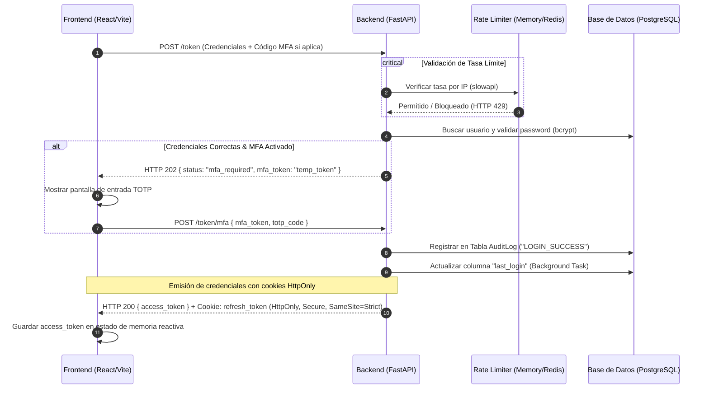
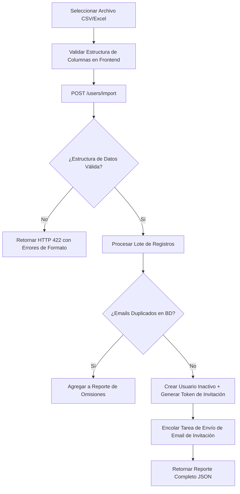

# Plan Técnico Detallado: Mejoras e Incorporaciones en Autenticación y Gestión de Usuarios

Este documento describe la planificación detallada, especificaciones técnicas y hoja de ruta para la implementación de las propuestas de mejora en el sistema de autenticación, control de accesos y administración de identidades del proyecto **Maestría: Sistema Integral de Planificación Estratégica (DIDACTICO)**.

El objetivo de este plan es elevar la robustez de la arquitectura actual a estándares de producción, reforzando la seguridad frente a vulnerabilidades comunes y garantizando una excelente experiencia de usuario (UX).

---

## 🗺️ Mapa de Ruta e Interacciones de Seguridad

El siguiente diagrama detalla cómo interactúan los nuevos componentes propuestos (Cookies HttpOnly, MFA/2FA, Rate Limiting y Logs de Auditoría) en el flujo de autenticación del sistema:



---

## 📂 Desglose Detallado de las Propuestas de Mejora

### 🛡️ Categoría A: Seguridad e Infraestructura de Acceso

#### 1. Flujo Completo de Recuperación de Credenciales
Permite a los usuarios restablecer contraseñas olvidadas de forma autónoma y segura a través de su correo electrónico institucional, eliminando la intervención del administrador.

*   **Especificación Técnica (Backend):**
    *   **Librerías:** `authlib` o `python-jose` (para la firma de tokens temporales de corta duración).
    *   **Nuevos Endpoints:**
        1.  `POST /auth/forgot-password`: Recibe el email del usuario. Verifica si existe y está activo en la base de datos. Si existe, genera un token JWT firmado de corta duración (15 minutos) con claims específicos (`{ "sub": email, "purpose": "pwd_reset" }`). El token se firma con una variable de entorno dedicada (`JWT_RESET_SECRET`). Posteriormente, encola una tarea asíncrona (`BackgroundTasks`) para enviar un correo institucional con el enlace dinámico: `https://didactico.edu/reset-password?token=<token>`.
        2.  `POST /auth/reset-password`: Recibe el cuerpo `{ token, new_password }`. Decodifica el token, valida su caducidad e integridad de firma, y comprueba el claim `purpose`. Si es válido, hashea la nueva contraseña (`get_password_hash`) y actualiza el campo en la base de datos.
    *   **Seguridad:** El token de restablecimiento solo debe ser utilizable una única vez.
*   **Especificación Técnica (Frontend):**
    *   **Nuevas Vistas/Rutas:**
        1.  `/forgot-password`: Pantalla con formulario simple que solicita el correo electrónico institucional. Emplea `react-hook-form` con validación `zod`. Al enviarse con éxito, muestra un mensaje amigable sugiriendo revisar la bandeja de entrada.
        2.  `/reset-password`: Pantalla que extrae el parámetro `token` de la URL. Muestra un formulario con campos para "Nueva Contraseña" y "Confirmar Contraseña", aplicando reglas de validación complejas (mínimo 8 caracteres, al menos una mayúscula, un número y un carácter especial).
    *   **Manejo de Estado:** Emplea `@tanstack/react-query` mediante `useMutation` para gestionar llamadas limpias con indicadores de carga y retroalimentación mediante notificaciones (*toasts*).

---

#### 2. Manejo de Refresh Tokens en Cookies HttpOnly
Mitiga el riesgo de robo de identidad y ataques XSS (Cross-Site Scripting) al evitar el almacenamiento de tokens de larga duración en el `localStorage` del navegador.

*   **Especificación Técnica (Backend):**
    *   **Variables de Entorno (.env):**
        *   `ACCESS_TOKEN_EXPIRE_MINUTES`: Define la duración del token de acceso de corta duración en minutos (ej. `15`).
        *   `REFRESH_TOKEN_EXPIRE_DAYS`: Define la duración del token de actualización de larga duración en días (ej. `7`).
    *   **Base de Datos:** Agregar una tabla `refresh_tokens` para llevar un registro de los tokens emitidos, permitiendo su revocación manual o detección de reutilización:
        ```sql
        CREATE TABLE refresh_tokens (
            id SERIAL PRIMARY KEY,
            user_id INTEGER REFERENCES users(id) ON DELETE CASCADE,
            token_hash VARCHAR(255) NOT NULL UNIQUE,
            expires_at TIMESTAMP WITH TIME ZONE NOT NULL,
            is_revoked BOOLEAN DEFAULT FALSE
        );
        ```
    *   **Modificaciones en endpoints:**
        1.  `POST /token`: Al iniciar sesión de forma exitosa, en lugar de retornar el `refresh_token` en el body del JSON, se genera un token de acceso de corta duración y un token de actualización de larga duración, cuyos tiempos de expiración son controlados de forma dinámica por las variables de entorno (`ACCESS_TOKEN_EXPIRE_MINUTES` y `REFRESH_TOKEN_EXPIRE_DAYS`). El `access_token` se incluye en el cuerpo JSON, mientras que el `refresh_token` se envía en una cabecera `Set-Cookie` con directivas: `HttpOnly`, `Secure` (solo HTTPS), `SameSite=Strict` y `Path=/api/auth/refresh`.
        2.  `POST /auth/refresh`: Endpoint que extrae de forma automática la cookie del cliente. Valida la firma del Refresh Token, comprueba en la BD que no haya expirado ni esté marcado como `is_revoked`. Si es válido, aplica una política de **Rotación de Refresh Tokens (RTR)**: invalida el token usado, genera un nuevo par (Access/Refresh) respetando los tiempos configurados en el `.env`, guarda el nuevo hash en la BD y envía los nuevos tokens de la misma forma que el login.
        3.  `POST /auth/logout`: Revoca el token en la BD y devuelve la cookie de actualización vacía con fecha de expiración en el pasado (`Max-Age=0`).
*   **Especificación Técnica (Frontend):**
    *   **Configuración de Axios:** Habilitar de manera global la propiedad `axios.defaults.withCredentials = true` para permitir el transporte automático de las cookies de origen seguro.
    *   **Manejo de Estado del Token:** Guardar el `access_token` exclusivamente en la memoria de la aplicación (e.g., un estado de React o un contexto global) y NUNCA en `localStorage` o `sessionStorage`.
    *   **Interceptores de Axios:** Implementar un interceptor de respuesta. Si un endpoint retorna `HTTP 401 Unauthorized` por token expirado, el interceptor debe poner en cola las peticiones pendientes, disparar una petición silenciosa a `/auth/refresh`, guardar el nuevo `access_token` reactivamente en memoria y volver a ejecutar la petición original transparente para el usuario.

---

#### 3. Autenticación Multifactor (MFA/2FA - TOTP)
Añade una capa secundaria de seguridad para evitar accesos no autorizados en cuentas críticas (en particular cuentas de administradores y coordinadores) incluso si las contraseñas son comprometidas.

*   **Especificación Técnica (Backend):**
    *   **Librerías:** `pyotp` (para generación y validación de TOTP) y `qrcode` (para generación de códigos QR).
    *   **Base de Datos:** Modificar la tabla `users` incorporando las siguientes columnas:
        ```sql
        ALTER TABLE users 
        ADD COLUMN mfa_secret VARCHAR(32) DEFAULT NULL,
        ADD COLUMN mfa_enabled BOOLEAN DEFAULT FALSE;
        ```
    *   **Nuevos Endpoints:**
        1.  `POST /auth/mfa/setup`: Genera un secreto TOTP aleatorio de base32 y retorna un string codificado en Base64 con la imagen del código QR para que el usuario la escanee usando Google Authenticator o Microsoft Authenticator.
        2.  `POST /auth/mfa/verify-and-enable`: Recibe el código TOTP de 6 dígitos. Valida su precisión contra el secreto temporal. Si coincide, establece `mfa_enabled = True` y guarda de forma persistente `mfa_secret` en el registro del usuario.
        3.  `POST /auth/mfa/disable`: Requiere autenticación y confirmación por código TOTP para desactivar la funcionalidad.
    *   **Ajuste en Flujo de Login (`POST /token`):** Si las credenciales primarias coinciden pero el usuario tiene `mfa_enabled = True`, el backend no debe devolver el access token. En su lugar, retorna una respuesta `HTTP 202 Accepted` con estructura `{ "status": "mfa_required", "mfa_token": "temp_jwt_token" }`. El cliente entonces debe consumir el endpoint `POST /token/mfa` enviando el `mfa_token` temporal y el código de 6 dígitos para obtener finalmente el `access_token`.
*   **Especificación Técnica (Frontend):**
    *   **Panel de Usuario:** Diseñar una sección en los ajustes de perfil dedicada a "Seguridad de la Cuenta" con un switch interactivo para activar la verificación en dos pasos.
    *   **UI/UX:** Presentar un modal elegante que renderice el código QR generado, instrucciones detalladas de configuración y un campo de 6 dígitos numéricos para verificar y confirmar la activación de forma inmediata.
    *   **Flujo de Login:** Si la respuesta de inicio de sesión devuelve `mfa_required`, cambiar dinámicamente la vista del login por una de entrada de código con temporizador visual.

---

#### 4. Mecanismos de Protección Antifuerza Bruta y Rate Limiting
Previene ataques automatizados de adivinación de contraseñas y protege la infraestructura del backend ante sobrecargas malintencionadas de peticiones de red.

*   **Especificación Técnica (Backend):**
    *   **Librerías:** `slowapi` (implementación de Rate Limiting para FastAPI basada en límites de Python).
    *   **Base de Datos (Bloqueo de Cuentas):**
        ```sql
        ALTER TABLE users
        ADD COLUMN failed_login_attempts INTEGER DEFAULT 0,
        ADD COLUMN lockout_until TIMESTAMP WITH TIME ZONE DEFAULT NULL;
        ```
    *   **Lógica de Bloqueo Progresivo:**
        *   Cada intento fallido incrementa en `1` la columna `failed_login_attempts`.
        *   Al alcanzar los `5` intentos fallidos consecutivos, calcula un bloqueo temporal: `lockout_until = datetime.utcnow() + timedelta(minutes=15)`.
        *   Cualquier petición subsiguiente antes de la expiración de la penalización debe ser rechazada de inmediato con un error `HTTP 423 Locked`.
        *   Un inicio de sesión exitoso reinicia el contador de intentos fallidos a `0` y limpia la fecha del bloqueo.
    *   **Rate Limiting por Red:** Configurar límites globales en rutas de autenticación basadas en la dirección IP del cliente (ej. máximo de 5 peticiones por minuto para los endpoints `/token` y `/auth/forgot-password`).
*   **Especificación Técnica (Frontend):**
    *   **Alertas Contextuales:** Desarrollar un sistema de alertas estéticas que interpreten correctamente los códigos de estado `HTTP 423 Locked` (mostrando el tiempo restante en minutos para poder reintentar) y `HTTP 429 Too Many Requests` (indicando al usuario que ha excedido la tasa permitida de solicitudes).

---

### 💼 Categoría B: Funcionalidades Administrativas y Experiencia de Usuario (UX)

#### 5. Carga Masiva de Usuarios (Importador CSV/Excel)
Agiliza drásticamente el proceso de enrolamiento al permitir que un administrador cree decenas de cuentas de docentes con un solo archivo de hoja de cálculo.



*   **Especificación Técnica (Backend):**
    *   **Librerías:** `pandas` (para parseo y procesamiento de datos tabulares estructurados) y `openpyxl` (para soporte nativo de archivos Excel `.xlsx`).
    *   **Endpoint:** `POST /users/import` (restringido a `SUPER_ADMIN`). Recibe un archivo binario mediante `UploadFile`.
    *   **Lógica de Negocio:**
        1.  Verificar la extensión y codificación del archivo.
        2.  Cargar en un DataFrame de pandas y validar la presencia estricta de las columnas requeridas: `email`, `first_name`, `last_name`, `role`.
        3.  Validar sintaxis de correos electrónicos. Filtrar filas inválidas.
        4.  Comprobar si los correos electrónicos ya existen registrados en el sistema. Los registros duplicados se omiten pero se guardan en una lista de omisiones con su respectiva causa.
        5.  Para cada fila válida restante: insertar el usuario en estado inactivo (`is_active=False`) y con una contraseña temporal no utilizable.
        6.  Generar un token único de invitación y encolar el envío de correos.
        7.  Retornar una respuesta detallada con código `HTTP 207 Multi-Status` conteniendo: `{ "success_count": X, "failed_count": Y, "errors": [...] }`.
*   **Especificación Técnica (Frontend):**
    *   **UI/UX:** Agregar un botón destacado "Importar desde Archivo" en `UserManagement.tsx`. Este botón abrirá un modal interactivo con una zona de arrastrar y soltar archivos (*drag-and-drop*).
    *   **Retroalimentación:** Permitir la descarga de una plantilla base de CSV/Excel. Al finalizar el procesamiento del archivo subido, renderizar una lista con las filas que causaron error indicando exactamente la celda o dato conflictivo.

---

#### 6. Invitación de Registro Vía Correo Electrónico
Refuerza la confidencialidad de la información y la adopción del sistema, asegurando que las contraseñas nunca viajen en texto plano por canales inseguros y que cada usuario autogestione su primer acceso de forma supervisada.

*   **Especificación Técnica (Backend):**
    *   **Control de Acceso del Administrador:** Este flujo es de uso restrictivo para usuarios con privilegios de administrador (`SUPER_ADMIN`). Solo el administrador tiene permisos para crear usuarios y gatillar invitaciones o reenvíos.
    *   **Variables de Entorno (.env):**
        *   `SUPPORT_EMAIL`: Correo electrónico institucional de soporte técnico (ej. `soporte@didactico.edu`). Si una invitación falla o expira, se le indicará al usuario este medio de contacto.
        *   `INVITATION_TOKEN_EXPIRE_HOURS`: Define el ciclo de vida del token de invitación en horas (ej. `72` para 3 días).
    *   **Endpoints:**
        1.  `POST /auth/invite` (Protegido - Solo `SUPER_ADMIN`): Genera el registro de un nuevo usuario en estado inactivo (`is_active=False`) y despacha asíncronamente el correo de invitación.
        2.  `POST /users/{user_id}/resend-invitation` (Protegido - Solo `SUPER_ADMIN`): Permite al administrador forzar de manera manual la generación de un nuevo token firmado de invitación y reenviar el correo correspondiente en caso de que el original haya expirado o se haya extraviado.
        3.  `POST /auth/activate` (Público): Recibe `{ token, password }`. Si el token ha expirado o es inválido, retorna un código `HTTP 400 Bad Request` indicando explícitamente: *"El enlace ha expirado. Por favor, contacte al administrador del sistema o escriba al correo de soporte técnico: [SUPPORT_EMAIL]"*.
*   **Especificación Técnica (Frontend):**
    *   **Gestión en `UserManagement.tsx`:** Añadir una acción rápida en la grilla de administración para registros con estado "Pendiente" que permita al administrador hacer clic en "Reenviar Invitación".
    *   **Vista Pública `/activate-account`:** Vista dinámica que valida el token de la URL. Si el token no es válido o ha expirado, renderiza una interfaz de error amigable con un botón de llamada a la acción para contactar a soporte a través del correo configurado en la variable `SUPPORT_EMAIL`.

---

#### 7. Módulo de Auto-Gestión del Perfil del Usuario
Proporciona autonomía a cada docente y coordinador para mantener actualizados sus datos personales y credenciales bajo las políticas y límites definidos dinámicamente por el administrador.

*   **Especificación Técnica (Backend):**
    *   **Variables de Entorno (.env):**
        *   `SUPPORT_EMAIL`: Correo de soporte técnico de referencia para bloqueos o asistencia en cambios de perfil.
        *   `EDITABLE_PROFILE_FIELDS`: Lista separada por comas de campos del perfil que los usuarios tienen permitido modificar de forma autónoma (ej. `first_name,last_name,phone`).
    *   **Control del Administrador sobre Campos Editables:**
        *   El backend valida dinámicamente el payload en peticiones de actualización de perfil contra el listado de campos configurados en la variable de entorno `EDITABLE_PROFILE_FIELDS` o en una tabla de base de datos dedicada a la configuración del sistema (`system_settings`) modificable únicamente por administradores.
    *   **Endpoints:**
        1.  `GET /users/me`: Retorna los detalles del usuario actual basado en la inyección del token verificado.
        2.  `GET /users/me/config` (Autenticado): Retorna la lista de campos autorizados para edición según la política definida por el administrador y el correo `SUPPORT_EMAIL`.
        3.  `PATCH /users/me`: Procesa la actualización del perfil del usuario. Si el usuario intenta enviar datos para campos no autorizados (que no figuren en `EDITABLE_PROFILE_FIELDS` o en la tabla de configuración), la petición se rechaza con un código `HTTP 403 Forbidden` indicando: *"No está autorizado a modificar el campo [field_name]. Solicite este cambio al correo de soporte técnico: [SUPPORT_EMAIL]"*.
        4.  `POST /users/me/change-password`: Recibe `{ current_password, new_password }`. Compara primero la validez del password actual. Si coincide, calcula y guarda el hash del nuevo password.
*   **Especificación Técnica (Frontend):**
    *   **Componente `UserProfile.tsx`:** 
        *   Consume al cargar el endpoint `/users/me/config` para determinar qué inputs del formulario debe habilitar.
        *   Los campos que el administrador decidió bloquear se renderizan en modo lectura (inhabilitados) y muestran un ícono decorativo de candado junto con un mensaje/tooltip dinámico: *"Este campo sólo puede ser modificado por administración. Si requiere cambiarlo, contacte a soporte técnico en: [SUPPORT_EMAIL]"*.
        *   **Cambio de Contraseña:** Formulario secundario con confirmación doble.
        *   **Estado del MFA:** Acceso directo a la activación de la autenticación de doble factor.

---

#### 8. Filtros de Búsqueda Dinámicos en la UI
Agiliza la navegación del administrador cuando la nómina de usuarios del sistema supera los cientos de registros.

*   **Especificación Técnica (Frontend):**
    *   **Integración en `UserManagement.tsx`:** Ubicar una barra de herramientas de filtrado dinámico inmediatamente encima de la grilla de datos de `@tanstack/react-table`:
        *   **Buscador Rápido:** Caja de texto con retraso (*debounce* de 300ms) para buscar coincidencias difusas por nombre o correo.
        *   **Filtro por Rol:** Caja de selección (*Select*) con opciones: Todos, Super Administrador, Coordinador, Docente.
        *   **Filtro por Estado:** Selección rápida entre cuentas Activas o Inactivas.
    *   **Lógica:** Vincular los filtros directamente al hook `useQuery` de TanStack Query para refrescar de forma reactiva los resultados. En el backend, adaptar `GET /users` para aceptar parámetros opcionales `/users?search=...&role=...&active=...` y construir dinámicamente la consulta con SQLAlchemy.

---

### 📊 Categoría C: Auditoría y Control de Calidad

#### 9. Historial de Logs de Auditoría (Audit Trails)
Registra de forma inmutable todas las operaciones y eventos sensibles del sistema con el fin de rastrear accesos ilegítimos o investigar fallas operativas.

*   **Especificación Técnica (Backend & Base de Datos):**
    *   **Modelo de Base de Datos `AuditLog`:**
        ```sql
        CREATE TABLE audit_logs (
            id SERIAL PRIMARY KEY,
            user_id INTEGER REFERENCES users(id) ON DELETE SET NULL,
            action VARCHAR(50) NOT NULL,
            ip_address VARCHAR(45) NOT NULL,
            user_agent VARCHAR(255) NOT NULL,
            details JSONB DEFAULT NULL,
            created_at TIMESTAMP WITH TIME ZONE DEFAULT CURRENT_TIMESTAMP
        );
        CREATE INDEX idx_audit_logs_action_created ON audit_logs(action, created_at DESC);
        CREATE INDEX idx_audit_logs_user_created ON audit_logs(user_id, created_at DESC);
        ```
    *   **Middleware o Dependencia:** Crear un helper de registro asíncrono para no retrasar el tiempo de respuesta al cliente final.
    *   **Eventos a Registrar:**
        *   `LOGIN_SUCCESS`, `LOGIN_FAILED` (con IP origen).
        *   `USER_CREATED`, `USER_UPDATED`, `USER_DEACTIVATED` (detallando el ID y cambios en el payload JSONB).
        *   `PASSWORD_RESET_REQUESTED`, `PASSWORD_RESET_SUCCESS`.
        *   `MFA_ENABLED`, `MFA_DISABLED`.

---

#### 10. Control de Última Conexión (`last_login`)
Brinda visibilidad sobre la tasa de adopción de la plataforma por parte de los docentes e identifica de forma automatizada cuentas inactivas o abandonadas.

*   **Especificación Técnica (Backend):**
    *   **Base de Datos:**
        ```sql
        ALTER TABLE users 
        ADD COLUMN last_login TIMESTAMP WITH TIME ZONE DEFAULT NULL;
        ```
    *   **Lógica de Registro:** En el endpoint `/token` y `/token/mfa` (tras validar exitosamente el inicio de sesión), disparar una tarea en segundo plano usando `BackgroundTasks` de FastAPI que actualice el campo `last_login = datetime.utcnow()` para el registro del usuario en cuestión. Al hacerlo asíncronamente, se elimina la latencia transaccional durante el login de cara al usuario.
*   **Especificación Técnica (Frontend):**
    *   **Visualización en la Grilla:** Incorporar la columna "Última Conexión" en la grilla de administración de `UserManagement.tsx`.
    *   **Formateo:** Mostrar la marca de tiempo de forma amigable (legible en lenguaje natural en español como "Hace 3 horas", "Ayer a las 10:15" o "Nunca" si es `null`), valiéndose de funciones como `formatDistanceToNow` de la librería `date-fns` o mediante el uso de la API nativa de JavaScript `Intl.RelativeTimeFormat`.

---

## 📈 Plan de Priorización e Implementación (Hitos)

Para asegurar un desarrollo ordenado y minimizar los riesgos de regresión sobre las funcionalidades existentes, la implementación se dividirá en 4 fases incrementales:

### Fase 1: Refuerzo de Seguridad Base (Tokens HttpOnly + Auditoría)
*   **Paso 1.1:** Crear la base de datos de tokens de refresco e implementar el mecanismo de Cookies HttpOnly con rotación automática.
*   **Paso 1.2:** Incorporar el modelo `AuditLog` y configurar el registro automático para inicios de sesión.
*   **Paso 1.3:** Agregar e inyectar el control de `last_login` en tareas en segundo plano.
*   **Paso 1.4:** Reconfigurar interceptores de Axios en el frontend y migrar el almacenamiento de tokens de acceso a memoria reactiva.

### Fase 2: Robustecimiento de Accesos (MFA + Bloqueo/Rate Limiting)
*   **Paso 2.1:** Configurar `slowapi` en FastAPI para mitigar el abuso de endpoints sensibles.
*   **Paso 2.2:** Desarrollar la lógica en BD para el bloqueo automático de cuentas tras 5 fallos consecutivos de password.
*   **Paso 2.3:** Integrar el soporte e interfaz para la activación y autenticación por TOTP (MFA/2FA).

### Fase 3: Gestión e Invitaciones Autónomas (Invitación + Recuperación)
*   **Paso 3.1:** Crear el flujo completo de recuperación de contraseñas mediante tokens temporales firmados enviados por email.
*   **Paso 3.2:** Reestructurar el alta de usuarios individuales hacia un flujo de invitación activa por correo institucional.
*   **Paso 3.3:** Diseñar en frontend las interfaces públicas de activación de cuenta y reinicio de credenciales.

### Fase 4: Productividad Administrativa y UX (Carga Masiva + Ajustes)
*   **Paso 4.1:** Implementar el lector y procesador de archivos masivos CSV/Excel en el Backend usando pandas.
*   **Paso 4.2:** Desarrollar en React el panel de carga de lotes de usuarios con retroalimentación visual en pantalla.
*   **Paso 4.3:** Crear el módulo de "Mi Perfil" para autogestión de datos personales del usuario.
*   **Paso 4.4:** Añadir los filtros avanzados y la barra de herramientas dinámica sobre la tabla en `UserManagement.tsx`.

---

> [!NOTE]
> Este plan técnico sirve como guía definitiva de arquitectura e implementación. Todas las fases de desarrollo deben acompañarse de pruebas unitarias específicas tanto en frontend (mediante Jest/React Testing Library) como en backend (usando Pytest e inyección de base de datos de pruebas).
