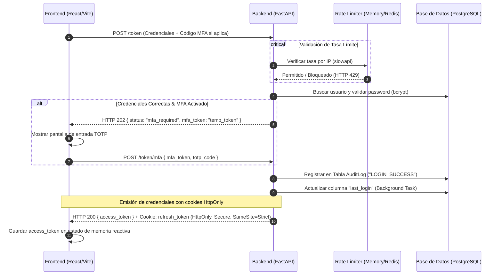
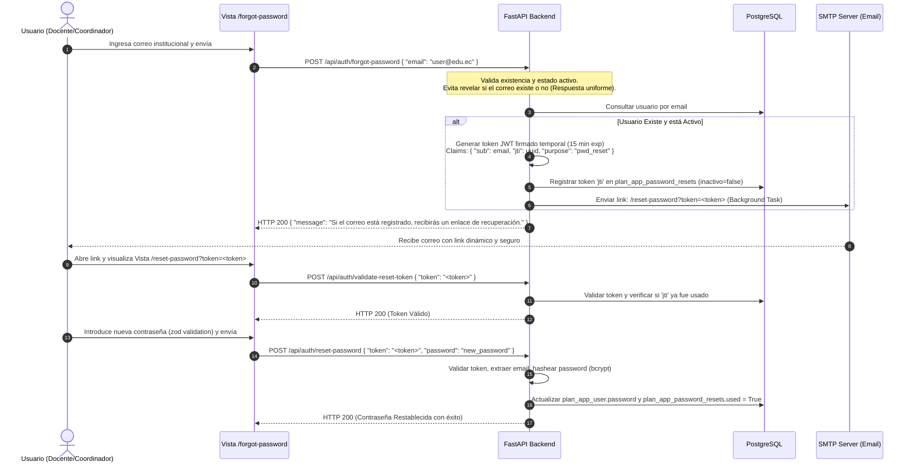
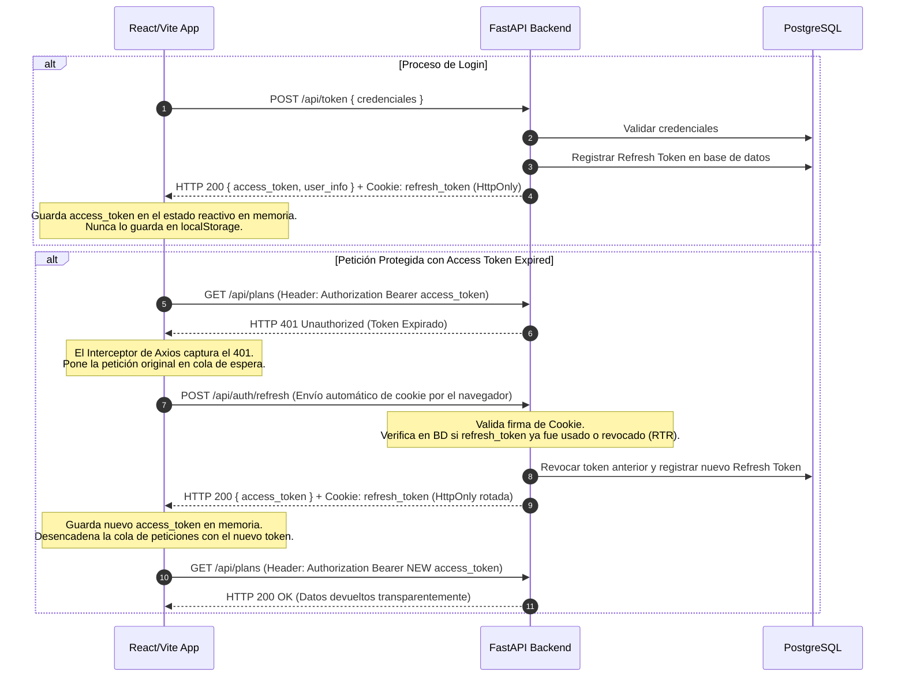
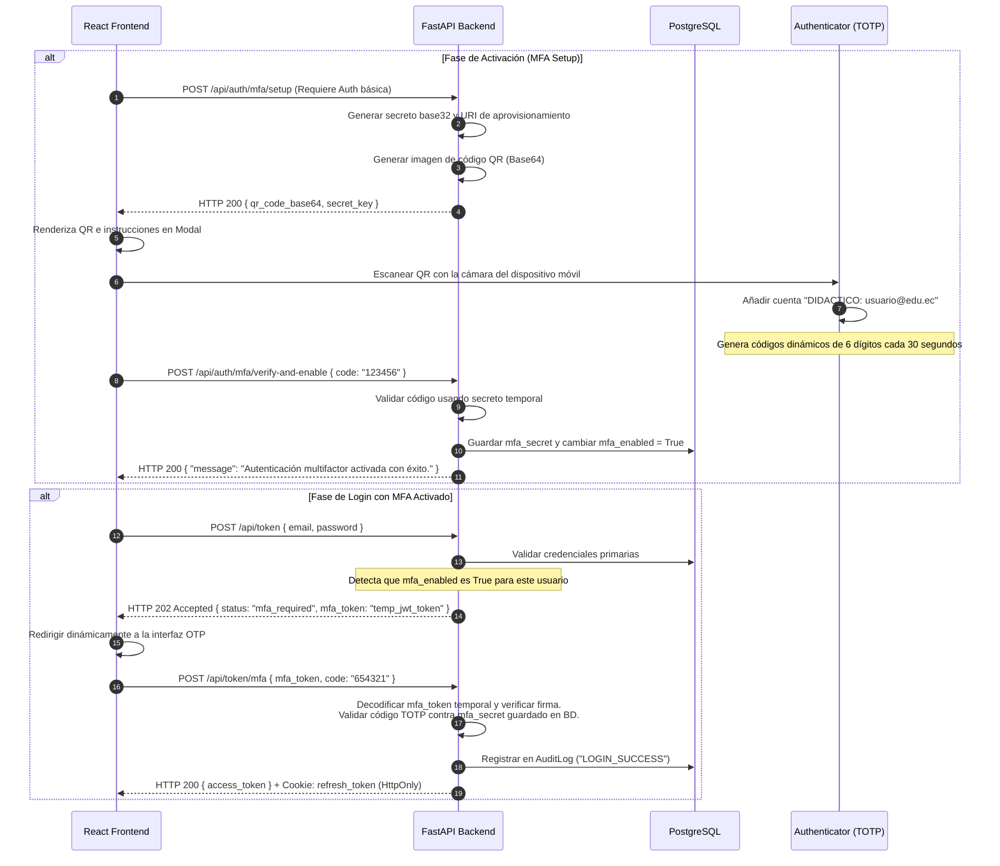
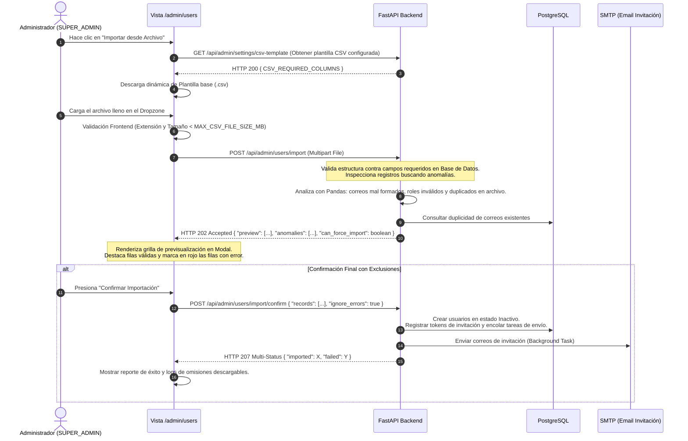
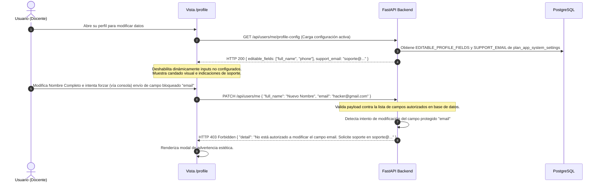
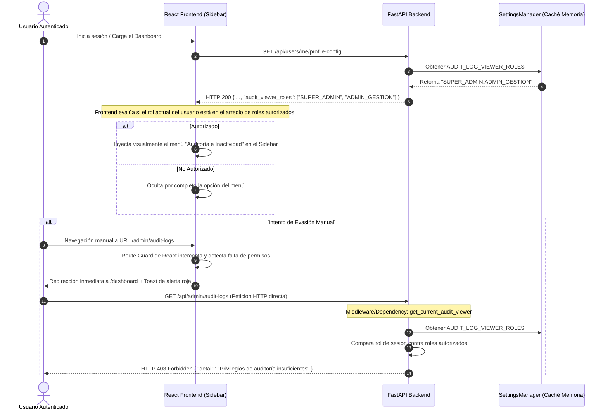

# Plan Técnico Detallado: Mejoras e Incorporaciones en Autenticación y Gestión de Usuarios

Este documento describe la planificación detallada, especificaciones técnicas y hoja de ruta para la implementación de las propuestas de mejora en el sistema de autenticación, control de accesos y administración de identidades del proyecto **Maestría: Sistema Integral de Planificación Estratégica (DIDACTICO)**.

El objetivo de este plan es elevar la robustez de la arquitectura actual a estándares de producción, reforzando la seguridad frente a vulnerabilidades comunes y garantizando una excelente experiencia de usuario (UX).

---

## 🗺️ Mapa de Ruta e Interacciones de Seguridad

El siguiente diagrama detalla cómo interactúan los nuevos componentes propuestos (Cookies HttpOnly, MFA/2FA, Rate Limiting y Logs de Auditoría) en el flujo de autenticación del sistema:



---

## 📂 Desglose Detallado de las Propuestas de Mejora

### 🛡️ Categoría A: Seguridad e Infraestructura de Acceso

El robustecimiento de la seguridad e infraestructura de acceso del sistema **DIDACTICO** es una prioridad crítica para proteger datos institucionales y de planificación docente. A continuación, se presenta un desglose de ingeniería con el máximo nivel de detalle para la implementación de las propuestas de la Categoría A.

---

#### 1. Flujo Completo de Recuperación de Credenciales

Permite a los usuarios restablecer contraseñas de forma autónoma y segura a través de su correo electrónico institucional, mitigando vectores de ataque basados en spoofing y garantizando que un atacante no pueda deducir cuentas válidas (User Enumeration).



*   **Especificación Técnica (Backend):**
    *   **Librerías Requeridas:** `python-jose[cryptography]` para firmas criptográficas de alta seguridad de los tokens JWT temporales.
    *   **Base de Datos (Tabla de Control de Reset Tokens):**
        Para asegurar que el token se utilice **una sola vez**, se implementará la siguiente tabla física que almacena el identificador único del token (`jti`):
        ```sql
        CREATE TABLE plan_app_password_resets (
            id SERIAL PRIMARY KEY,
            jti VARCHAR(255) NOT NULL UNIQUE,
            email VARCHAR(255) NOT NULL,
            expires_at TIMESTAMP WITH TIME ZONE NOT NULL,
            used BOOLEAN DEFAULT FALSE,
            created_at TIMESTAMP WITH TIME ZONE DEFAULT CURRENT_TIMESTAMP
        );
        CREATE INDEX idx_pwd_resets_jti ON plan_app_password_resets(jti);
        ```
    *   **Modelos Pydantic (Request/Response):**
        ```python
        from pydantic import BaseModel, EmailStr, Field

        class ForgotPasswordRequest(BaseModel):
            email: EmailStr = Field(..., description="Correo electrónico institucional")

        class ResetPasswordRequest(BaseModel):
            token: str = Field(..., description="Token JWT de restablecimiento")
            new_password: str = Field(..., min_length=8, description="Nueva contraseña del usuario")
            
        class ValidateTokenRequest(BaseModel):
            token: str
        ```
    *   **Algoritmo del Endpoint `POST /api/auth/forgot-password`:**
        1. Recibe el payload `ForgotPasswordRequest`.
        2. Realiza una búsqueda del usuario. Si el usuario no existe o está inactivo, **no lanza un error 404/401** (evitando la enumeración de usuarios). En su lugar, el backend simula un retardo hash aleatorio (`bcrypt.hashpw` falso) y devuelve un código de estado `HTTP 200 OK` con un mensaje genérico.
        3. Si el usuario existe y está activo:
           - Genera un `jti` único (`uuid.uuid4()`).
           - Genera un JWT firmado con `JWT_RESET_SECRET` de 256 bits, configurando claims:
             `{ "sub": email, "jti": str(jti), "purpose": "pwd_reset", "exp": datetime.utcnow() + timedelta(minutes=15) }`.
           - Registra la fila en la tabla `plan_app_password_resets`.
           - Registra un evento en la tabla de logs de auditoría: `PASSWORD_RESET_REQUESTED`.
           - Dispara una tarea asíncrona mediante `BackgroundTasks` de FastAPI que envía un correo HTML responsivo empleando plantillas estructuradas de Jinja2. El correo contiene el enlace dinámico:
             `https://didactico.edu/reset-password?token=<token>`.
    *   **Algoritmo del Endpoint `POST /api/auth/reset-password`:**
        1. Recibe el payload `ResetPasswordRequest`.
        2. Decodifica el token usando `JWT_RESET_SECRET`. Si falla la firma, la expiración o el claim `purpose` no es `"pwd_reset"`, lanza `HTTP 400 Bad Request` ("Token inválido o expirado").
        3. Extrae `jti` y `sub` (email).
        4. Consulta la tabla `plan_app_password_resets` usando `jti`.
        5. Si la fila no existe, tiene `used = True` o `expires_at < datetime.utcnow()`, lanza `HTTP 400 Bad Request` ("El token ya ha sido utilizado o ha expirado").
        6. Si el token es válido:
           - Hashea la nueva contraseña (`pwd_context.hash(new_password)`).
           - Actualiza la contraseña en el modelo de usuario.
           - Marca la fila del token en `plan_app_password_resets` como `used = True`.
           - Registra el evento en logs de auditoría: `PASSWORD_RESET_SUCCESS`.
           - Retorna `HTTP 200 OK` ("Contraseña actualizada correctamente").

*   **Especificación Técnica (Frontend):**
    *   **Rutas e Interfaces UI:**
        1. `/forgot-password`: Formulario limpio con un solo campo `email`. Se utiliza `react-hook-form` con validación de esquema `zod` (`z.string().email("Correo institucional no válido")`). Cuenta con animación de carga (`spinner`) en el botón durante la petición.
        2. `/reset-password`: Extrae de forma reactiva el token de los parámetros de búsqueda URL (`useSearchParams`). Muestra campos para "Nueva Contraseña" y "Confirmar Contraseña" con un medidor visual de fortaleza de contraseña (fuerza estimada en base a entropía de caracteres).
    *   **Reglas Estrictas de Validación Frontend (Zod Schema):**
        ```typescript
        const resetPasswordSchema = z.object({
          password: z.string()
            .min(8, "La contraseña debe tener al menos 8 caracteres")
            .regex(/[A-Z]/, "Debe contener al menos una letra mayúscula")
            .regex(/[a-z]/, "Debe contener al menos una letra minúscula")
            .regex(/[0-9]/, "Debe contener al menos un número")
            .regex(/[^A-Za-z0-9]/, "Debe contener al menos un carácter especial"),
          confirmPassword: z.string()
        }).refine((data) => data.password === data.confirmPassword, {
          message: "Las contraseñas no coinciden",
          path: ["confirmPassword"],
        });
        ```
    *   **Gestión de Estado y Mutaciones:**
        - Emplea `@tanstack/react-query` (`useMutation`) para gestionar las peticiones asíncronas.
        - Muestra notificaciones contextuales interactivas (*toasts*) con la librería `react-hot-toast` o `sonner`: verde para éxito (redireccionando automáticamente a `/login` tras 3 segundos) y rojo para errores.

*   **Pasos Detallados de Implementación a Realizar (Paso a Paso):**
    *   **Paso 1.1 (Backend - Migración y Modelado de Datos de Restablecimiento):**
        1. Diseñar y ejecutar la migración en base de datos para crear la tabla `plan_app_password_resets` con las columnas especificadas (`id`, `jti`, `email`, `expires_at`, `used`, `created_at`).
        2. Configurar un índice de alto rendimiento sobre la columna `jti` para optimizar las consultas de validación de tokens.
        3. Crear el modelo de base de datos SQLAlchemy correspondiente en `sys-core/api/models.py`.
    *   **Paso 1.2 (Backend - Endpoints y Lógica de Negocio de Contraseñas):**
        1. Definir los esquemas Pydantic (`ForgotPasswordRequest`, `ResetPasswordRequest`, `ValidateTokenRequest`) en `sys-core/api/schemas.py`.
        2. Desarrollar el endpoint `POST /api/auth/forgot-password` en `sys-core/api/routers/auth.py`. Implementar una simulación de delay con bcrypt cuando el correo no exista para evitar la enumeración de usuarios.
        3. Configurar el envío asíncrono del enlace de recuperación en segundo plano utilizando `BackgroundTasks` de FastAPI, integrando una plantilla HTML en Jinja2.
        4. Implementar el endpoint de validación `POST /api/auth/validate-reset-token` y el endpoint de restablecimiento final `POST /api/auth/reset-password` realizando las validaciones de expiración, de un solo uso (`used = True`), hasheando con bcrypt la nueva contraseña y marcando el token como utilizado.
    *   **Paso 1.3 (Frontend - Vistas de Recuperación y Reglas de Validación Zod):**
        1. Crear los componentes React para las vistas `/forgot-password` y `/reset-password` en `sys-plan/src/components/auth/`.
        2. Diseñar interfaces responsivas con un estilo minimalista premium y glassmorphism.
        3. Implementar la validación rigurosa de robustez de contraseña mediante el esquema Zod (`resetPasswordSchema`) exigiendo longitud mínima, mayúsculas, minúsculas, números y caracteres especiales.
        4. Integrar las mutaciones con `@tanstack/react-query` y proveer toasts interactivos utilizando `sonner` para la retroalimentación de éxito (con redirección diferida a `/login`) o error.

---

#### 2. Manejo de Refresh Tokens en Cookies HttpOnly

Mitiga por completo el riesgo de secuestro de sesión a través de ataques Cross-Site Scripting (XSS) evitando depositar el token de larga duración en `localStorage` o `sessionStorage` (almacenes expuestos a scripts inyectados).



*   **Especificación Técnica (Backend):**
    *   **Estructura Base de Datos (`refresh_tokens`):**
        Para permitir la auditoría de accesos activos y proteger al sistema frente a la reutilización maliciosa de tokens de refresco, se requiere un esquema físico dedicado:
        ```sql
        CREATE TABLE plan_app_refresh_tokens (
            id SERIAL PRIMARY KEY,
            user_id INTEGER REFERENCES plan_app_user(id) ON DELETE CASCADE,
            token_hash VARCHAR(255) NOT NULL UNIQUE,
            jti VARCHAR(255) NOT NULL UNIQUE,
            expires_at TIMESTAMP WITH TIME ZONE NOT NULL,
            is_revoked BOOLEAN DEFAULT FALSE,
            created_at TIMESTAMP WITH TIME ZONE DEFAULT CURRENT_TIMESTAMP,
            parent_jti VARCHAR(255) DEFAULT NULL -- Permite rastrear la cadena de rotación (token lineage)
        );
        CREATE INDEX idx_refresh_tokens_jti ON plan_app_refresh_tokens(jti);
        ```
    *   **Propiedades y Directivas de la Cookie de Refresco:**
        La cookie se emitirá con parámetros de máxima seguridad:
        - `HttpOnly=True`: Impide que JavaScript acceda al token a través de `document.cookie`.
        - `Secure=True`: Obliga a que la cookie solo viaje en canales cifrados HTTPS.
        - `SameSite=Strict`: Previene el transporte de la cookie en solicitudes cruzadas para bloquear ataques CSRF (Cross-Site Request Forgery).
        - `Path=/api/auth/refresh`: La cookie solo es expuesta y transmitida cuando el cliente realiza llamadas a la ruta específica de renovación de tokens, reduciendo la superficie de exposición del token.
        - `Max-Age` / `Expires`: Emparejado con el valor de la variable de entorno `REFRESH_TOKEN_EXPIRE_DAYS` (ej. 7 días).
    *   **Implementación de Rotación de Refresh Tokens (RTR):**
        Cuando un usuario realiza `POST /api/auth/refresh`:
        1. Extrae la cookie `refresh_token`. Si no existe, eleva `HTTP 401 Unauthorized`.
        2. Decodifica la cookie. Si el token está corrupto o expirado, eleva `HTTP 401`.
        3. Extrae el `jti` único del Refresh Token.
        4. Consulta en base de datos la fila del Refresh Token correspondiente al `jti`.
        5. **Detección de Reutilización (Ataque de Replay):**
           - Si la fila existe pero tiene `is_revoked = True`, significa que alguien está intentando usar un token que ya fue reemplazado en el flujo de rotación normal.
           - **Acción Inmediata de Mitigación:** Revoca inmediatamente todos los Refresh Tokens vigentes asociados al `user_id` de esa sesión (forzando un cierre de sesión inmediato en todos los dispositivos del usuario comprometido), registra un log de alerta crítica de auditoría: `REFRESH_TOKEN_REPLAY_ATTACK_DETECTED`, y eleva un error `HTTP 401 Unauthorized`.
        6. Si el Refresh Token está activo y es válido:
           - Se marca el token actual como usado/revocado (`is_revoked = True`).
           - Se genera un nuevo Access Token (duración configurada en `ACCESS_TOKEN_EXPIRE_MINUTES`, ej. 15 min).
           - Se genera un nuevo Refresh Token (con nuevo `jti`, heredando la fecha límite máxima de la sesión o extendiéndola según directiva).
           - Se registra el nuevo Refresh Token en `plan_app_refresh_tokens` guardando el `parent_jti` del token anterior para mantener la genealogía.
           - Devuelve el `access_token` en el JSON body y configura el nuevo `refresh_token` en la cabecera `Set-Cookie`.

*   **Especificación Técnica (Frontend):**
    *   **Configuración Global de Axios:**
        Se define en el punto de entrada de la aplicación (`main.tsx` o `index.tsx`):
        ```typescript
        import axios from 'axios';
        axios.defaults.withCredentials = true; // Permite el transporte de la cookie HttpOnly
        axios.defaults.baseURL = import.meta.env.VITE_API_URL;
        ```
    *   **Manejo de Estado del Token en React:**
        - El `access_token` se almacena exclusivamente en memoria local dentro de un contexto de autenticación global (`AuthContext.tsx`) mediante un estado de React `const [accessToken, setAccessToken] = useState<string | null>(null)`.
        - Al recargar la aplicación, un hook `useEffect` hace una llamada silenciosa inicial a `/api/auth/refresh` para recuperar el estado de autenticación de forma transparente.
    *   **Interceptor de Axios para Auto-Refresco (Token Refreshing Queue):**
        ```typescript
        let isRefreshing = false;
        let failedQueue: any[] = [];

        const processQueue = (error: any, token: string | null = null) => {
          failedQueue.forEach(prom => {
            if (token) {
              prom.resolve(token);
            } else {
              prom.reject(error);
            }
          });
          failedQueue = [];
        };

        axios.interceptors.response.use(
          (response) => response,
          async (error) => {
            const originalRequest = error.config;

            if (error.response?.status === 401 && !originalRequest._retry) {
              if (isRefreshing) {
                return new Promise((resolve, reject) => {
                  failedQueue.push({ resolve, reject });
                })
                  .then(token => {
                    originalRequest.headers['Authorization'] = 'Bearer ' + token;
                    return axios(originalRequest);
                  })
                  .catch(err => Promise.reject(err));
              }

              originalRequest._retry = true;
              isRefreshing = true;

              return new Promise((resolve, reject) => {
                axios.post('/api/auth/refresh')
                  .then(({ data }) => {
                    const newAccessToken = data.access_token;
                    // Actualizar el token en el contexto reactivo
                    setGlobalAccessToken(newAccessToken); 
                    
                    axios.defaults.headers.common['Authorization'] = 'Bearer ' + newAccessToken;
                    originalRequest.headers['Authorization'] = 'Bearer ' + newAccessToken;
                    
                    processQueue(null, newAccessToken);
                    resolve(axios(originalRequest));
                  })
                  .catch((err) => {
                    processQueue(err, null);
                    // Limpiar contexto de autenticación y redirigir a Login
                    logoutUser(); 
                    reject(err);
                  })
                  .finally(() => {
                    isRefreshing = false;
                  });
              });
            }

            return Promise.reject(error);
          }
        );
        ```

*   **Pasos Detallados de Implementación a Realizar (Paso a Paso):**
    *   **Paso 2.1 (Backend - Tabla de Control y Emisión Segura de Cookies):**
        1. Diseñar e implementar la migración para la tabla `plan_app_refresh_tokens` incluyendo soporte para genealogía de tokens con `parent_jti`.
        2. Crear el modelo de base de datos SQLAlchemy en `sys-core/api/models.py` e indexar la columna `jti`.
        3. Modificar la función de login para que, al autenticar exitosamente, se genere tanto el `access_token` en memoria como el `refresh_token`. El refresh token se encripta y se inyecta en una cookie HttpOnly con las directivas de seguridad más estrictas (`HttpOnly=True`, `Secure=True`, `SameSite=Strict`, `Path=/api/auth/refresh`, y su tiempo de expiración correspondiente).
    *   **Paso 2.2 (Backend - Implementación de Rotación y Detección de Ataques Replay):**
        1. Desarrollar el endpoint `POST /api/auth/refresh` en `sys-core/api/routers/auth.py`.
        2. Implementar la validación y rotación atómica de tokens de refresco (RTR).
        3. Programar el mecanismo de defensa contra ataques de replay: si un `refresh_token` ya utilizado (`is_revoked = True`) es presentado, invalidar inmediatamente todos los tokens de refresco activos del usuario (`is_revoked = True` para todas sus sesiones), registrar un evento de seguridad crítico en auditoría (`REFRESH_TOKEN_REPLAY_ATTACK_DETECTED`) y retornar `HTTP 401 Unauthorized`.
    *   **Paso 2.3 (Frontend - Gestión del Token en Memoria e Interceptor de Renovación Silenciosa):**
        1. Configurar Axios con `withCredentials = true` por defecto en `sys-plan/src/main.tsx` o en un cliente Axios personalizado para permitir el viaje automático de la cookie HttpOnly.
        2. Diseñar en `AuthContext.tsx` el estado local de React para almacenar el `access_token` exclusivamente en memoria de la aplicación, evitando exponerlo en `localStorage` o `sessionStorage`.
        3. Configurar un hook de carga inicial (`useEffect`) que realice un refresh silencioso al iniciar la aplicación.
        4. Implementar el interceptor de respuestas de Axios para gestionar de forma transparente los errores de token expirado (`HTTP 401`): pausar peticiones concurrentes, encolarlas en `failedQueue`, solicitar un nuevo token de acceso a `/api/auth/refresh` de forma transparente y reintentar las peticiones encoladas tras la rotación exitosa.

---

#### 3. Autenticación Multifactor (MFA/2FA - TOTP)

Añade una defensa criptográfica secundaria de factor independiente (Posesión de dispositivo móvil) que anula intentos de acceso no autorizados incluso si la contraseña primaria ha sido vulnerada por técnicas de phising, fuga de base de datos o fuerza bruta.



*   **Especificación Técnica (Backend):**
    *   **Librerías Requeridas:** `pyotp` (generación e interpretación de contraseñas de un solo uso basadas en el tiempo) y `qrcode` (generación automatizada de las representaciones en imagen del código QR).
    *   **Esquema de Base de Datos Modificado (plan_app_user):**
        ```sql
        ALTER TABLE plan_app_user 
        ADD COLUMN mfa_secret VARCHAR(32) DEFAULT NULL,
        ADD COLUMN mfa_enabled BOOLEAN DEFAULT FALSE;
        ```
    *   **Modelos Pydantic (Request/Response):**
        ```python
        class MFASetupResponse(BaseModel):
            secret: str = Field(..., description="Clave secreta en Base32")
            qr_code: str = Field(..., description="Imagen del código QR codificada en Base64")

        class MFAVerifyRequest(BaseModel):
            code: str = Field(..., min_length=6, max_length=6, regex="^[0-9]+$", description="Código OTP de 6 dígitos")

        class MFADisableRequest(BaseModel):
            code: str = Field(..., min_length=6, max_length=6, regex="^[0-9]+$", description="Código OTP actual")

        class MFATokenLoginRequest(BaseModel):
            mfa_token: str = Field(..., description="Token JWT temporal de inicio de sesión con MFA")
            code: str = Field(..., min_length=6, max_length=6, regex="^[0-9]+$")
        ```
    *   **Lógica de Endpoints:**
        1. `POST /api/auth/mfa/setup` (Protegido - Requiere Auth de Acceso):
           - Genera un secreto base32 aleatorio usando `pyotp.random_base32()`.
           - Guarda temporalmente el secreto en la sesión de memoria caché o en una columna temporal de pre-configuración en BD (para evitar activar MFA sin verificarlo primero).
           - Genera la URI estándar de aprovisionamiento:
             `pyotp.totp.TOTP(secret).provisioning_uri(name=user.email, issuer_name="DIDACTICO")`.
           - Utiliza la librería `qrcode` para renderizar un archivo de imagen PNG con la URI.
           - Convierte los bytes de la imagen a un string formateado en base64: `"data:image/png;base64,..."`.
           - Retorna el objeto `MFASetupResponse`.
        2. `POST /api/auth/mfa/verify-and-enable` (Protegido):
           - Recibe el código de 6 dígitos.
           - Compara el código contra el secreto temporal mediante: `totp = pyotp.TOTP(temp_secret)`.
           - Llama a `totp.verify(code)`.
           - **Importante (Seguridad):** Se requiere mitigar ataques de replay de códigos OTP. Por lo tanto, `totp.verify(code, valid_window=1)` debe validar el desfase de tiempo máximo permitido (1 intervalo de 30 segundos anterior/posterior para amortiguar desincronizaciones del reloj del cliente).
           - Si la verificación tiene éxito:
             - Actualiza al usuario asignando `mfa_secret = temp_secret` y estableciendo `mfa_enabled = True`.
             - Registra el evento en logs de auditoría: `MFA_ENABLED`.
             - Retorna `HTTP 200 OK`.
           - Si falla, eleva `HTTP 400 Bad Request` ("Código de seguridad incorrecto").
        3. Ajuste del Login Primario (`POST /api/token`):
           - Si las credenciales primarias (email/contraseña) son válidas y `user.mfa_enabled = True`:
             - Encripta y firma un token JWT de vida extremadamente corta (5 minutos de expiración):
               `{ "sub": user.email, "purpose": "mfa_pending", "exp": datetime.utcnow() + timedelta(minutes=5) }` firmado con una clave privada dedicada `JWT_MFA_SECRET`.
             - Registra en logs de auditoría: `LOGIN_STEP_ONE_SUCCESS` indicando el éxito del primer factor.
             - Retorna una cabecera de estado `HTTP 202 Accepted` indicando `{ "status": "mfa_required", "mfa_token": "temp_jwt_token" }`.
        4. `POST /api/token/mfa` (Público):
           - Recibe el `mfa_token` y el código OTP de 6 dígitos.
           - Valida la integridad, vigencia de firma y el claim `purpose` de `mfa_token` usando `JWT_MFA_SECRET`.
           - Extrae el correo del usuario (`sub`) y consulta el registro en base de datos.
           - Valida el código TOTP provisto empleando el secreto guardado `user.mfa_secret`.
           - Si coincide, genera el `access_token` final, guarda el `refresh_token` en cookie HttpOnly y devuelve `HTTP 200 OK` con el mismo formato del login estándar.
           - Registra en logs de auditoría: `LOGIN_SUCCESS` (MFA verificado).

*   **Especificación Técnica (Frontend):**
    *   **Diseño de la Interfaz del Panel de Configuración de MFA:**
        - Incorpora un componente elegante en la sección de seguridad de `/profile`.
        - Si está desactivado, muestra un botón "Activar Verificación en Dos Pasos". Al hacer clic, abre un modal con un stepper animado:
          1. *Paso 1*: Descarga y apertura de la App de autenticación en el celular.
          2. *Paso 2*: Escaneo de código QR (muestra la imagen base64 cargada dinámicamente) y visualización del código en texto plano en caso de fallo de cámara.
          3. *Paso 3*: Campo de texto numérico segmentado (un input para cada dígito con foco automático al escribir) para confirmación de la activación de forma interactiva.
    *   **Vista Especial del Login para Ingreso de Código MFA:**
        - Al detectar el código `HTTP 202 Accepted` y la propiedad `status: "mfa_required"`, la pantalla del login realiza una transición suave de opacidad desactivando los campos de usuario y contraseña.
        - Renderiza un formulario centralizado enfocado a la validación OTP con un botón de cancelación (para volver a la pantalla de credenciales primarias) y soporte para pegado directo de códigos desde el portapapeles.

*   **Pasos Detallados de Implementación a Realizar (Paso a Paso):**
    *   **Paso 3.1 (Backend - Extensión del Esquema de Usuarios e Integración de TOTP):**
        1. Modificar el modelo `plan_app_user` en base de datos agregando las columnas `mfa_secret` and `mfa_enabled`.
        2. Integrar las librerías `pyotp` y `qrcode` en `sys-core/requirements.txt` y habilitarlas en el backend.
        3. Desarrollar el endpoint `POST /api/auth/mfa/setup` para generar un secreto base32 aleatorio, guardarlo temporalmente y devolver una imagen de código QR codificada en Base64 con el esquema estándar de aprovisionamiento.
    *   **Paso 3.2 (Backend - Flujos de Verificación y Login de Doble Factor):**
        1. Desarrollar el endpoint `POST /api/auth/mfa/verify-and-enable` que valida el código OTP proporcionado contra el secreto temporal (utilizando una ventana de tolerancia de +/- 30 segundos) para mitigar desincronizaciones y prevenir ataques de replay del código OTP, persistiendo el estado en base de datos.
        2. Modificar el flujo de autenticación primario (`POST /api/token`): si el usuario tiene `mfa_enabled = True`, retornar `HTTP 202 Accepted` indicando `{ "status": "mfa_required", "mfa_token": "temp_jwt_token" }`.
        3. Desarrollar el endpoint público `POST /api/token/mfa` para validar el `mfa_token` temporal firmado y el código TOTP, emitiendo finalmente el par de tokens (`access_token` y la cookie `refresh_token HttpOnly`) tras la validación correcta.
    *   **Paso 3.3 (Frontend - Stepper de Configuración y Transición OTP en Login):**
        1. Diseñar el panel de activación de MFA en el perfil de usuario (`sys-plan/src/components/profile/`) con un stepper animado (descarga, escaneo del QR, validación del código de confirmación con inputs segmentados).
        2. Modificar la pantalla de Login en `sys-plan/src/components/Login.tsx` para interceptar la respuesta `HTTP 202` y realizar una transición visual fluida hacia la vista de entrada OTP, manteniendo una experiencia UX elegante.

---

#### 4. Mecanismos de Protección Antifuerza Bruta y Rate Limiting

Establece una barrera de defensa impenetrable contra ataques automatizados de adivinación de contraseñas (Credential Stuffing / Dictionary Attacks) e intentos de denegación de servicio (DoS) a nivel de endpoints críticos del sistema de autenticación.

```mermaid
graph TD
    A[Petición entrante a /api/token] --> B{¿IP supera límite de red?<br/>(Rate Limit: 5 peticiones/min)}
    B -- Sí --> C[Retornar HTTP 429 Too Many Requests]
    B -- No --> D{Consultar cuenta de usuario}
    D --> E{¿Cuenta Bloqueada?<br/>(lockout_until > actual)}
    E -- Sí --> F[Retornar HTTP 423 Locked]
    E -- No --> G{¿Credenciales Válidas?}
    G -- Sí --> H[Reiniciar contador failed_attempts a 0]
    H --> I[Establecer lockout_until a NULL]
    I --> J[Procesar Login Exitoso]
    G -- No --> K[Incrementar failed_login_attempts + 1]
    K --> L{¿failed_login_attempts >= 5?}
    L -- Sí --> M[Establecer lockout_until = actual + 15 min]
    M --> N[Registrar en AuditLog: USER_LOCKED_OUT]
    N --> O[Retornar HTTP 401 o 423 indicando el bloqueo]
    L -- No --> P[Retornar HTTP 401 Credenciales Inválidas]
```

*   **Especificación Técnica (Backend):**
    *   **Librerías Requeridas:** `slowapi` (implementación nativa de Rate Limiting para aplicaciones FastAPI, con soporte basado en el algoritmo Token Bucket).
    *   **Esquema de Base de Datos Modificado (plan_app_user):**
        ```sql
        ALTER TABLE plan_app_user
        ADD COLUMN failed_login_attempts INTEGER DEFAULT 0,
        ADD COLUMN lockout_until TIMESTAMP WITH TIME ZONE DEFAULT NULL;
        ```
    *   **Lógica de Bloqueo de Cuenta (Account Lockout Policy):**
        - Cada vez que se procesa una autenticación de primer factor (`POST /api/token`) o segundo factor (`POST /api/token/mfa`) y la contraseña o el token OTP es incorrecto:
          1. El backend busca el usuario y extrae su contador actual `failed_login_attempts`.
          2. Si `lockout_until` no es nulo y la fecha actual es menor que `lockout_until`, el backend inmediatamente eleva un error `HTTP 423 Locked` sin realizar la validación de la contraseña en base de datos.
          3. Si no hay bloqueo activo o ya expiró el tiempo de penalización:
             - Valida la contraseña.
             - Si la contraseña es inválida:
               - Incrementa en 1 `failed_login_attempts`.
               - Si `failed_login_attempts` alcanza el límite de **5 intentos consecutivos**:
                 - Calcula la marca de tiempo de desbloqueo: `lockout_until = datetime.utcnow() + timedelta(minutes=15)`.
                 - Registra el evento crítico en el registro de auditoría: `USER_ACCOUNT_LOCKED` indicando el email afectado y la IP origen.
                 - Eleva un error `HTTP 423 Locked` indicando que la cuenta ha sido temporalmente inhabilitada por razones de seguridad.
               - Si es menor a 5, registra en base de datos el incremento del contador y eleva `HTTP 401 Unauthorized` ("Credenciales incorrectas").
             - Si la contraseña es válida:
               - Reinicia a 0 el campo `failed_login_attempts`.
               - Establece `lockout_until = None`.
               - Continúa con el flujo normal de login.
    *   **Configuración y Lógica de Rate Limiting en Red:**
        - Se instancia e inicializa `slowapi` vinculándolo a un servidor de almacenamiento en memoria ultrarrápida como Redis en entornos de producción (o memoria local en desarrollo):
          ```python
          from slowapi import Limiter, _rate_limit_exceeded_handler
          from slowapi.util import get_remote_address
          from slowapi.errors import RateLimitExceeded

          limiter = Limiter(key_func=get_remote_address)
          app.state.limiter = limiter
          app.add_exception_handler(RateLimitExceeded, _rate_limit_exceeded_handler)
          ```
        - Configuración de límites dedicados en endpoints críticos de autenticación:
          - `/api/token`: Límite estricto de `@limiter.limit("5/minute")` por dirección IP.
          - `/api/auth/forgot-password`: Límite estricto de `@limiter.limit("3/minute")` por dirección IP para evitar abuso del servidor SMTP.

*   **Especificación Técnica (Frontend):**
    *   **Interpretación de Códigos de Error HTTP y UX:**
        - El frontend intercepta los errores del backend mediante la estructura de captura de excepciones en las mutaciones de TanStack Query:
          1. **Error HTTP 423 (Locked):**
             - Muestra un banner visual en color rojo fuego con diseño premium y un icono de candado.
             - Extrae e interpreta la propiedad `lockout_until` o el tiempo de bloqueo enviado por el backend.
             - Implementa un **Temporizador Dinámico en Pantalla** en el frontend (ej. *"Tu cuenta ha sido bloqueada debido a múltiples intentos fallidos. Podrás intentar de nuevo en 14:52 minutos"*), deshabilitando por completo el botón de login durante el período de penalización para evitar peticiones repetitivas innecesarias al servidor.

*   **Pasos Detallados de Implementación a Realizar (Paso a Paso):**
    *   **Paso 4.1 (Backend - Configuración de Límite de Tasa en Red con slowapi):**
        1. Instalar y configurar `slowapi` en la inicialización de FastAPI en `sys-core/api/main.py` utilizando la IP del cliente como clave de limitación.
        2. Decorar el endpoint de autenticación `/api/token` con un límite estricto de `@limiter.limit("5/minute")` para mitigar ataques de denegación de servicio o Credential Stuffing.
        3. Decorar el endpoint de recuperación `/api/auth/forgot-password` con un límite estricto de `@limiter.limit("3/minute")` para proteger la infraestructura SMTP del abuso de envío de correos.
    *   **Paso 4.2 (Backend - Implementación de la Política de Bloqueo de Cuentas):**
        1. Modificar el modelo de usuario `plan_app_user` para soportar las columnas `failed_login_attempts` y `lockout_until`.
        2. Implementar en la lógica del backend la verificación de bloqueo: si `lockout_until` está activo y la hora actual es inferior, denegar inmediatamente el acceso retornando `HTTP 423 Locked`.
        3. Registrar el incremento de intentos fallidos en la base de datos tras credenciales incorrectas. Al alcanzar los 5 intentos consecutivos, establecer `lockout_until` a 15 minutos en el futuro y registrar el evento crítico en el registro de auditoría (`USER_ACCOUNT_LOCKED`).
        4. Asegurar que tras un inicio de sesión exitoso, el contador `failed_login_attempts` se restablezca automáticamente a 0 y `lockout_until` se configure en `None`.
    *   **Paso 4.3 (Frontend - Interceptor de Bloqueo y Temporizador UX Dinámico):**
        1. Actualizar el interceptor de Axios y las llamadas de autenticación en React para manejar el código de estado `HTTP 423 Locked`.
        2. Diseñar un banner visual premium en color rojo fuego con un icono de candado que muestre con claridad el bloqueo temporal de la cuenta.
        3. Implementar un temporizador de cuenta regresiva en tiempo real en la pantalla de Login que deshabilite el botón de envío y los inputs, mostrando dinámicamente los minutos y segundos restantes antes del desbloqueo automático.

---

### 💼 Categoría B: Funcionalidades Administrativas y Experiencia de Usuario (UX)

Esta categoría describe la implementación de una arquitectura de gobernanza absoluta delegada en el rol `SUPER_ADMIN` a través de un **Área Especial de Configuración del Administrador (System Settings Board)**. Esta área centraliza la parametrización dinámica del sistema en tiempo de ejecución, eliminando dependencias de variables de entorno estáticas en archivos `.env` y asegurando que todas las funcionalidades operativas (Carga Masiva, Invitaciones de Registro, Auto-Gestión del Perfil del Usuario y Filtros de Búsqueda) estén gobernadas dinámicamente y con el máximo nivel de control para la administración.

---

#### 0. Área Especial de Configuración de Gobernanza (System Settings Panel)

Se diseñará e implementará un panel exclusivo y de acceso altamente restrictivo (reservado únicamente para usuarios con rol `SUPER_ADMIN`), que servirá como el núcleo de gobernanza y control operativo de la plataforma **DIDACTICO**. Este panel guardará y modificará la base de configuraciones en tiempo real para todos los módulos.

##### 📑 Arquitectura y Modelo Físico de Datos (`plan_app_system_settings`):

Para garantizar la persistencia del estado administrativo, se creará la siguiente estructura física altamente optimizada e indexada en PostgreSQL:

```sql
CREATE TABLE plan_app_system_settings (
    id SERIAL PRIMARY KEY,
    key VARCHAR(100) NOT NULL UNIQUE,
    value TEXT NOT NULL,
    description TEXT,
    category VARCHAR(50) DEFAULT 'GENERAL',
    updated_at TIMESTAMP WITH TIME ZONE DEFAULT CURRENT_TIMESTAMP,
    updated_by INTEGER REFERENCES plan_app_user(id) ON DELETE SET NULL
);

-- Índices optimizados para lecturas rápidas
CREATE INDEX idx_system_settings_key ON plan_app_system_settings(key);
CREATE INDEX idx_system_settings_category ON plan_app_system_settings(category);

-- Configuración exhaustiva inicial de variables dinámicas de control administrativo
INSERT INTO plan_app_system_settings (key, value, description, category) VALUES
-- Ajustes Generales y Canales de Ayuda
('SUPPORT_EMAIL', 'soporte@didactico.edu.ec', 'Dirección de correo electrónico de la mesa de ayuda institucional para resolver incidencias de acceso', 'GENERAL'),
('DEFAULT_PAGINATION_LIMIT', '20', 'Cantidad de registros mostrados por defecto en grillas de datos paginadas (10, 20, 50, 100)', 'GENERAL'),

-- Seguridad y Control de Expiraciones
('INVITATION_TOKEN_EXPIRE_HOURS', '72', 'Periodo de vigencia física (en horas) para los enlaces cifrados de invitación a usuarios nuevos', 'SECURITY'),
('ENFORCE_MFA_ROLES', 'SUPER_ADMIN,ADMIN_GESTION,COORDINADOR', 'Lista de roles institucionales obligados a configurar y validar el segundo factor (MFA/2FA) para operar', 'SECURITY'),
('SESSION_IDLE_TIMEOUT_MINUTES', '30', 'Tiempo de inactividad del usuario antes de revocar automáticamente el access token y forzar logout', 'SECURITY'),

-- Gobernanza sobre la Carga Masiva (CSV/Excel)
('CSV_REQUIRED_COLUMNS', 'email,first_name,last_name,role', 'Cabeceras estrictamente obligatorias que debe validar el validador del importador masivo', 'ADMIN'),
('MAX_CSV_FILE_SIZE_MB', '5', 'Tamaño máximo de archivo permitido en el cargador masivo de usuarios para prevenir ataques de denegación por sobrecarga (DoS)', 'ADMIN'),
('CSV_AUTO_ACTIVATE_USERS', 'false', 'Determina si las cuentas importadas masivamente se marcan como activas al crearse (true) o si deben pasar por activación obligatoria (false)', 'ADMIN'),

-- Gobernanza sobre el Auto-Registro e Invitación
('REGISTRATION_METHOD', 'INVITATION_ONLY', 'Determina el método de registro de cuentas: INVITATION_ONLY (el administrador debe invitar mediante email), u OFF (registro completamente inhabilitado temporalmente)', 'ADMIN'),
('MAX_INVITATIONS_PER_DAY', '100', 'Límite diario de invitaciones enviadas encoladas por lote para proteger al servidor SMTP institucional de bloqueos por spam', 'ADMIN'),

-- Gobernanza sobre Auto-Gestión del Perfil del Usuario
('EDITABLE_PROFILE_FIELDS', 'full_name,phone,avatar_url', 'Columnas que el usuario común tiene derecho a editar de manera autónoma desde su panel de perfil', 'PROFILE'),
('ENABLE_PASSWORD_CHANGE_BY_USER', 'true', 'Permite a los usuarios normales cambiar su contraseña de manera autónoma en el módulo de configuración de perfil', 'PROFILE'),
('MINIMUM_PASSWORD_STRENGTH_SCORE', '3', 'Nivel de entropía mínimo exigido para nuevas contraseñas en escala de 0 a 4 (usando librería zxcvbn)', 'PROFILE'),

-- Integración de Servidor de Mensajería SMTP
('SMTP_HOST', 'smtp.office365.com', 'Dirección del host del servidor SMTP institucional para envíos de alertas e invitaciones', 'EMAIL'),
('SMTP_PORT', '587', 'Puerto de red TCP utilizado por el servidor de correo institucional', 'EMAIL'),
('SMTP_USER', 'didactico-noreply@edu.ec', 'Usuario de autenticación del servidor SMTP', 'EMAIL');
```

```mermaid
graph TD
    subgraph Panel de Administración (Vista /admin/settings)
        A[SUPER_ADMIN] -->|Modifica Ajustes| B(Ajustes de Seguridad y Perfiles)
        A -->|Modifica Ajustes| C(Ajustes de Carga Masiva y SMTP)
        A -->|Modifica Ajustes| D(Ajustes de Auto-Gestión y Registro)
    end
    B -->|PATCH /api/admin/settings| E[FastAPI: Controller Admin]
    C -->|PATCH /api/admin/settings| E
    D -->|PATCH /api/admin/settings| E
    E -->|Validar Rol| F{¿Es SUPER_ADMIN?}
    F -- No --> G[HTTP 403 Forbidden]
    F -- Sí --> H[Actualizar Tabla plan_app_system_settings]
    H --> I[Limpiar Caché de Configuración en Backend]
    I --> J[Registrar AuditLog: SYSTEM_SETTINGS_UPDATED]
```

*   **Pasos Detallados de Implementación a Realizar (Paso a Paso):**
    *   **Paso 0.1 (Backend - Caché de Configuración Altamente Eficiente):**
        1. Para mitigar la latencia y evitar consultas continuas a PostgreSQL en cada petición HTTP, se implementará una clase singleton en memoria llamada `SettingsManager` en el backend.
        2. Esta clase cargará las configuraciones dinámicas de la tabla `plan_app_system_settings` en un diccionario estructurado al arrancar la aplicación.
        3. Se implementará un mecanismo de invalidación reactiva: cuando el endpoint `PATCH /api/admin/settings` es llamado de forma exitosa, se fuerza la recarga de las variables desde la base de datos al diccionario de la memoria de forma inmediata.
        4. Toda llamada del backend para validar operaciones del sistema utilizará la consulta en caché a través de la función inyectada `get_cached_setting(key)`.
    *   **Paso 0.2 (Backend - Validación de Variables Dinámicas en JSON):**
        1. Crear el endpoint `GET /api/admin/settings` protegido bajo el esquema de dependencias de FastAPI `current_user` validando que el rol sea estrictamente `SUPER_ADMIN`.
        2. Crear el endpoint `PATCH /api/admin/settings` que recibe un cuerpo de solicitud estructurado. El validador Pydantic comprobará la sintaxis de cada clave para asegurar la integridad de la base de datos:
           - Si la clave `SUPPORT_EMAIL` no cumple con una estructura de correo electrónico válida, lanzará error.
           - Si las claves numéricas (`INVITATION_TOKEN_EXPIRE_HOURS`, `MAX_CSV_FILE_SIZE_MB`) reciben valores no numéricos, lanzará un error de formato `HTTP 422 Unprocessable Entity`.
           - Si `EDITABLE_PROFILE_FIELDS` contiene columnas inexistentes en el modelo de base de datos de usuario, rechazará la solicitud para proteger la integridad estructural de la tabla de usuarios.
    *   **Paso 0.3 (Frontend - Arquitectura de la Interfaz `/admin/settings`):**
        1. Crear una interfaz interactiva premium estructurada en pestañas laterales responsivas de tipo "Glassmorphism" con transiciones suaves en CSS:
           - **Gobernanza del Sistema**: Switch dinámico para definir si el registro está bloqueado o solo se permite mediante invitaciones (`REGISTRATION_METHOD`), control del tiempo máximo de tokens (`INVITATION_TOKEN_EXPIRE_HOURS`), y entrada numérica para límites diarios.
           - **Carga Masiva de Usuarios**: Entrada de texto enriquecido para ingresar las cabeceras CSV obligatorias mediante "Tags" dinámicos (badges autocerrables) y límites en megabytes para el archivo.
           - **Privacidad y Auto-Gestión de Perfiles**: Checkboxes estilizados mapeados a los campos del docente (e.g. `Nombre completo`, `Teléfono`, `Identificación Institucional`, `Avatar`) que determinan si son editables o de solo lectura.
           - **Servidor SMTP**: Formulario protegido con inputs de tipo contraseña para claves de acceso de SMTP y botones de diagnóstico para mandar correos de prueba de red de forma automática.
        2. Configurar la gestión de estado mediante `@tanstack/react-query` y proveer notificaciones táctiles y visuales interactivas (*Toasts* dinámicos con `sonner`) que alerten al administrador si hay configuraciones sin guardar (*dirty state detection*).

---

#### 5. Carga Masiva de Usuarios (Importador CSV/Excel)

El proceso de alta de múltiples usuarios en el sistema estará gobernado en su totalidad por las variables definidas por el administrador en la consola de gobernanza especial (específicamente `CSV_REQUIRED_COLUMNS`, `MAX_CSV_FILE_SIZE_MB`, `CSV_AUTO_ACTIVATE_USERS`).



*   **Pasos Detallados de Implementación a Realizar (Paso a Paso):**
    *   **Paso 5.1 (Backend - Validación de Reglas en Red y Archivos):**
        1. El endpoint `POST /api/admin/users/import` intercepta la carga del archivo multipart.
        2. Obtiene de forma inmediata el valor dinámico `MAX_CSV_FILE_SIZE_MB` desde `SettingsManager`. Compara el tamaño de los bytes recibidos y, si supera el valor parametrizado, interrumpe el procesamiento y retorna un error `HTTP 413 Payload Too Large` con la indicación del límite actual en pantalla.
        3. Verifica la extensión del archivo (`.csv` o `.xlsx`) mediante la cabecera `Content-Type`.
    *   **Paso 5.2 (Backend - Procesamiento de Estructura Dinámica con Pandas):**
        1. Carga los bytes del archivo en un DataFrame de `pandas`.
        2. Limpia los datos de forma exhaustiva: ejecuta `df.columns = df.columns.str.strip().str.lower()` para estandarizar las columnas sin importar variaciones accidentales de capitalización o espacios por parte del administrador.
        3. Recupera de la memoria caché la lista separada por comas de la clave `CSV_REQUIRED_COLUMNS` (ej. `"email,first_name,last_name,role"`).
        4. Compara el listado de columnas del archivo cargado contra las requeridas por gobernanza administrativa. Si existe alguna discrepancia (e.g. falta la columna `role`), interrumpe la ejecución y retorna un error descriptivo detallando exactamente cuáles columnas faltan en el documento.
    *   **Paso 5.3 (Backend - Análisis Detallado de Registros e Identificación de Errores):**
        1. Inicializa un arreglo vacío de anomalías (`anomalies`) y una lista de registros procesados para previsualización.
        2. Valida fila por fila el DataFrame de pandas aplicando las siguientes reglas:
           - **Sintaxis de Correo**: Utiliza una expresión regular estructurada para asegurar la veracidad del correo electrónico institucional.
           - **Validación de Roles**: Compara el valor del campo `role` con el set de valores autorizados en el enumerado `UserRole` (`SUPER_ADMIN`, `ADMIN_GESTION`, `COORDINADOR`, `DOCENTE`).
           - **Duplicidad Interna**: Detecta si el mismo correo electrónico se repite varias veces en distintas filas dentro de la misma plantilla cargada.
           - **Duplicidad en Base de Datos**: Ejecuta búsquedas indexadas y optimizadas de tipo bulk en la tabla `plan_app_user` para mapear los correos que ya pertenecen a cuentas activas o inactivas.
        3. Genera un reporte dinámico estructurado en formato JSON con el estado detallado de cada fila (`fila`, `email`, `valida: true/false`, `errores: ["razon_1", "razon_2"]`, `datos_originales`).
    *   **Paso 5.4 (Backend - Confirmación Transaccional y Emisión de Invitaciones):**
        1. El endpoint `POST /api/admin/users/import/confirm` recibe la lista depurada de registros confirmados por el administrador.
        2. Abre una transacción atómica SQL utilizando SQLAlchemy (`db.begin()`).
        3. Lee la directiva `CSV_AUTO_ACTIVATE_USERS` y `INVITATION_TOKEN_EXPIRE_HOURS` en `plan_app_system_settings`.
        4. Para cada cuenta autorizada:
           - Inserta el usuario de manera limpia. Si `CSV_AUTO_ACTIVATE_USERS` es `false`, se crea en estado inactivo (`is_active = False`) con una clave temporal hasheada altamente compleja.
           - Genera un token JWT seguro y firma criptográficamente con el tiempo de expiración configurado por el administrador (`INVITATION_TOKEN_EXPIRE_HOURS`).
           - Si corresponde, crea una fila en la tabla de auditoría e invitaciones activas (`plan_app_invitations`).
           - Encola el envío asíncrono del correo de bienvenida e invitación con los datos de activación de cuenta.
        5. Cierra y confirma de forma exitosa la transacción SQL. Si ocurre un fallo fortuito en base de datos, ejecuta un `ROLLBACK` total y reporta el error sin generar datos inconsistentes o corruptos.
    *   **Paso 5.5 (Frontend - Interfaz Interactiva de Procesamiento y Grilla):**
        1. Diseñar en la interfaz `/admin/users` una zona estética interactiva de arrastrar y soltar (*Dropzone*) con animaciones en bucle y soporte para lectura directa de archivos en formato CSV y Excel.
        2. Al finalizar el análisis del backend, despliega un modal enriquecido con estadísticas de importación (e.g. *"45 registros válidos listos para importar, 5 registros con errores, 0 duplicados"*).
        3. Renderiza una grilla interactiva que destaca las filas con fallas críticas en color rojo e incorpora botones contextuales interactivos para que el administrador pueda elegir "Ignorar registros con fallas e importar válidos" o "Descargar reporte de fallas en CSV" para depurar los registros incorrectos de forma offline.

---

#### 6. Invitación de Registro Vía Correo Electrónico (Control de Enlace)

El registro autónomo de nuevos usuarios o docentes no estará abierto al público de manera descontrolada. El administrador gobierna por completo la creación de accesos limitándola al flujo de **Invitaciones Firmadas y Parametrizadas**, controlado dinámicamente desde el Área Especial de Configuración (clave `REGISTRATION_METHOD`).

*   **Pasos Detallados de Implementación a Realizar (Paso a Paso):**
    *   **Paso 6.1 (Backend - Creación e Inserción Controlada de Invitaciones):**
        1. El endpoint `/api/admin/invitations/create` recibe del administrador `{ email, first_name, last_name, role }`.
        2. Comprueba el estado de la variable `REGISTRATION_METHOD` en el panel de configuración de base de datos. Si está establecido en `OFF`, bloquea de forma inmediata la operación retornando un error `HTTP 403 Forbidden` con indicación del soporte institucional.
        3. Realiza la comprobación física e indexada de que el correo institucional no pertenece a ninguna cuenta preexistente.
        4. Lee el valor dinámico de `INVITATION_TOKEN_EXPIRE_HOURS` en `plan_app_system_settings`.
        5. Genera un token firmado con JWT que contiene los claims `{ "sub": email, "jti": uuid, "purpose": "account_activation", "exp": datetime.utcnow() + timedelta(hours=expire_hours) }`.
        6. Inserta el registro del usuario inactivo y genera la entrada persistente en la tabla `plan_app_invitations`, registrando el token de seguridad, el ID de usuario inactivo asignado, la fecha exacta de expiración y el estado `is_revoked = False`.
        7. Construye la URL de activación: `https://didactico.edu.ec/activate-account?token=<token>`.
        8. Invoca una tarea en segundo plano (`BackgroundTasks`) que despacha el correo mediante plantillas responsivas en HTML. El texto del mensaje cargará dinámicamente el valor del campo `SUPPORT_EMAIL` para facilitar la resolución de dudas técnicas.
    *   **Paso 6.2 (Backend - Consola de Control de Invitaciones para el Administrador):**
        1. Implementar los endpoints de monitoreo de invitaciones para la consola de gobernanza:
           - `GET /api/admin/invitations`: Retorna la lista total de invitaciones emitidas indicando destinatario, fecha de creación, expiración técnica y su estado categorizado en: `Activa`, `Expirada` o `Revocada`.
           - `POST /api/admin/invitations/{id}/resend`: Invalida de forma permanente la invitación original marcando `is_revoked = True` en la fila del registro. Crea un nuevo token de acceso con expiración extendida regenerando las credenciales y enviando el correo de invitación refrescado de forma instantánea.
           - `DELETE /api/admin/invitations/{id}`: Revoca la invitación activa y elimina permanentemente de la base de datos el registro del usuario inactivo, protegiendo las cuotas de cuentas y liberando el correo en caso de que el administrador haya cometido algún error al redactarlo.
    *   **Paso 6.3 (Backend - Verificación de Invitación y Activación de Cuenta):**
        1. El endpoint público `POST /api/auth/activate` recibe el payload conteniendo `{ token, password }`.
        2. Decodifica el token. Si la firma es corrupta o la fecha de vencimiento es menor a la actual, obtiene de la tabla de configuración administrativa el valor de la clave `SUPPORT_EMAIL` y devuelve un error amigable estructurado: *"El enlace de activación ha expirado o es inválido. Por favor, solicita una nueva invitación o contacta al administrador en: [SUPPORT_EMAIL]"*.
        3. Verifica en la tabla `plan_app_invitations` que la columna `is_revoked` sea estrictamente `False`.
        4. Valida que la contraseña recibida cumpla con el nivel de entropía exigido dinámicamente en el parámetro administrativo `MINIMUM_PASSWORD_STRENGTH_SCORE`.
        5. Hashea la contraseña e inserta el hash en el registro del usuario inactivo, cambiando de inmediato el estado del registro a `is_active = True`.
        6. Actualiza de manera atómica el registro de la invitación en `plan_app_invitations` marcándola como usada (`is_revoked = True`) para bloquear cualquier intento de reapertura o ataque de repetición.
        7. Registra de forma inmutable el evento en logs de auditoría: `USER_ACTIVATION_SUCCESS`.
    *   **Paso 6.4 (Frontend - Panel de Visualización y Gestión del Administrador):**
        1. Diseñar e integrar una pestaña exclusiva denominada **Invitaciones de Acceso** dentro de la consola administrativa en la interfaz del frontend `UserManagement.tsx`.
        2. Muestra una tabla con estilos modernos que destaca mediante distintivos de colores interactivos (*Badges* de estado) el estado real de cada invitación.
        3. Dispone de botones contextuales rápidos para "Reenviar Enlace de Invitación" (con icono dinámico de recarga de red) y "Eliminar Invitación" (con modal de confirmación en color rojo para evitar ejecuciones accidentales).

---

#### 7. Módulo de Auto-Gestión del Perfil del Usuario

El Módulo de Configuración y Datos Personales del Usuario estará estrictamente restringido por las directrices dictadas por el administrador a través del panel de gobernanza central, el cual define qué datos son de edición permitida para docentes y coordinadores (clave `EDITABLE_PROFILE_FIELDS` y `ENABLE_PASSWORD_CHANGE_BY_USER`).



*   **Pasos Detallados de Implementación a Realizar (Paso a Paso):**
    *   **Paso 7.1 (Backend - Interceptación y Validación de Campos Autorizados):**
        1. Al procesar una solicitud de edición sobre el endpoint `PATCH /api/users/me`:
           - Obtiene inmediatamente la lista en caché de campos autorizados por el administrador a través de la variable `EDITABLE_PROFILE_FIELDS` (por ejemplo, `"full_name,phone,avatar_url"`).
           - Analiza recursivamente el JSON recibido del cuerpo de la petición. Si detecta la presencia de claves protegidas de la cuenta (como `email`, `role`, `is_active` o `lockout_until` inyectados a través de solicitudes alteradas manuales en red):
             - Recupera de la base de datos el valor de `SUPPORT_EMAIL`.
             - Rechaza de inmediato la solicitud entera sin persistir cambios en base de datos, elevando un error `HTTP 403 Forbidden` con el mensaje estructurado: *"El campo [nombre_del_campo] está restringido por políticas administrativas del sistema. Si requiere modificar este dato, póngase en contacto directo con soporte técnico en: [SUPPORT_EMAIL]"*.
           - Si la validación es exitosa y todos los parámetros enviados forman parte de la lista permitida, persiste los cambios de forma segura en PostgreSQL y registra el evento en logs de auditoría: `USER_PROFILE_UPDATED`.
    *   **Paso 7.2 (Backend - Control Dinámico sobre Cambio de Contraseña):**
        1. Al recibir una solicitud en el endpoint `/api/users/me/change-password`:
           - Comprueba el estado de la variable dynamic `ENABLE_PASSWORD_CHANGE_BY_USER` en `SettingsManager`. Si su valor es `false`, interrumpe la llamada y eleva un error `HTTP 403 Forbidden` indicando al usuario que el cambio de contraseñas ha sido deshabilitado temporalmente por seguridad.
           - Si la directiva lo autoriza, valida la contraseña previa mediante `bcrypt` y aplica las reglas de validación de robustez configuradas.
           - Hashea la nueva contraseña y actualiza el campo correspondiente. Por seguridad e integridad de la cuenta, revoca todos los Refresh Tokens vigentes de esa cuenta en `plan_app_refresh_tokens` para obligar al usuario a iniciar sesión en todos sus navegadores activos.
    *   **Paso 7.3 (Frontend - Construcción Inteligente del Perfil del Docente `/profile`):**
        1. En la carga inicial de la vista de perfil en React (`useEffect`), realiza un consumo automático del endpoint de configuración dinámica del perfil `/api/users/me/profile-config`.
        2. Mapea la lista de campos autorizados y habilita o deshabilita los inputs del formulario en consecuencia:
           - Si el campo `email` no forma parte de la lista `editable_fields`, el input recibe de forma automática el atributo HTML `disabled` y se muestra con un diseño estilizado opaco.
           - Muestra sobre el input inhabilitado un icono interactivo de candado en color plata y un Tooltip estético que indica: *"Este campo está protegido por directivas de administración. Escriba a [SUPPORT_EMAIL] para solicitar cambios"* de forma automática.
        3. Implementa un componente interactivo medidor de fortaleza de contraseñas (*Password Strength Meter*) usando la librería `@zxcvbn-ts/core`, mostrando una barra de progreso multicolor (Rojo, Naranja, Amarillo, Verde) basada en la puntuación de entropía y validando en tiempo real antes de permitir el envío del formulario.

---

#### 8. Filtros de Búsqueda Dinámicos en la UI (Gobernanza de Datos)

Para evitar la sobrecarga y degradación del servidor PostgreSQL ante consultas repetitivas de administradores que navegan sobre registros extensos, el sistema implementará filtros parametrizados desde el Área Especial de Configuración (específicamente a través del parámetro `DEFAULT_PAGINATION_LIMIT`).

*   **Pasos Detallados de Implementación a Realizar (Paso a Paso):**
    *   **Paso 8.1 (Backend - Construcción de Filtros Dinámicos con SQLAlchemy):**
        1. Modificar el endpoint principal de consulta de cuentas `GET /api/admin/users`.
        2. Lee el parámetro de paginación por defecto `DEFAULT_PAGINATION_LIMIT` de la memoria caché. Si el parámetro del query string `limit` no se especifica, toma por defecto este valor.
        3. Acepta y procesa parámetros opcionales avanzados:
           - `search`: Texto libre a buscar.
           - `role`: Filtrado estricto de roles.
           - `active`: Filtrado booleano por estado de la cuenta.
           - `mfa_enabled`: Filtrado por estado de doble factor de seguridad.
           - `pending_invitation`: Filtra usuarios inactivos con invitaciones activas aún no expiradas.
        4. Construye la consulta dinámica en SQLAlchemy de forma progresiva:
           ```python
           query = db.query(User)
           
           if search:
               # Realiza búsquedas de coincidencia parcial en minúsculas y sin acentos sobre nombre y correo
               search_filter = f"%{search}%"
               query = query.filter(
                   or_(
                       User.full_name.ilike(search_filter),
                       User.email.ilike(search_filter)
                   )
               )
           if role:
               query = query.filter(User.role == role)
           if active is not None:
               query = query.filter(User.is_active == active)
           if mfa_enabled is not None:
               query = query.filter(User.mfa_enabled == mfa_enabled)
           if pending_invitation:
               # Realiza Join dinámico con plan_app_invitations buscando tokens activos
               query = query.join(Invitation).filter(
                   Invitation.is_revoked == False,
                   Invitation.expires_at > datetime.utcnow()
               )
           ```
        5. Ejecuta una llamada de recuento optimizada `query.count()` para obtener la métrica `total_count` requerida para construir la paginación reactiva en el frontend.
        6. Aplica los límites y saltos de filas calculados utilizando `.limit(limit).offset((page - 1) * limit)` y retorna el JSON final estandarizado con la estructura `{ "data": [...], "total_count": X, "page": Y, "total_pages": Z }`.
    *   **Paso 8.2 (Frontend - Barra de Herramientas Dinámica en `UserManagement.tsx`):**
        1. Crear una barra superior premium de filtrado en la grilla que consta de:
           - Un campo de búsqueda rápida con lupa animada y técnica de **Debounce de 300 milisegundos** para aplazar los disparos de peticiones HTTP en cada interacción del teclado, optimizando la red.
           - Selectores dinámicos estilizados e interactivos (*Dropdown Menus*) para realizar filtrados segmentados de forma limpia.
           - Un switch de selección rápida e interactiva para aislar de inmediato a los usuarios inactivos que aún no han completado el flujo de activación de correo institucional.
        2. Configurar la grilla de datos para reflejar estados de carga asíncronos (*Skeleton Screen states*) con animaciones en gradiente, manteniendo fluida y atractiva la experiencia del administrador al navegar sobre nóminas extensas.


### 📊 Categoría C: Auditoría y Control de Calidad

Esta categoría detalla la arquitectura de supervisión inmutable y el control de actividad del sistema, **completamente gobernada y administrada de forma dinámica por el administrador** a través de la consola especial de gobernanza. Se implementará un mecanismo donde el rol `SUPER_ADMIN` define a través del panel de configuración qué roles tienen permiso para visualizar la opción de Auditoría en el Dashboard y realizar consultas de red sobre la bitácora de logs. Asimismo, se proveerá un control exhaustivo sobre el estado de actividad de los usuarios, permitiendo la desactivación y alertas manuales o automáticas por inactividad prolongada.

---

#### 9. Gobernanza de Acceso y Visibilidad Dinámica del Panel de Auditoría

Para evitar el acoplamiento rígido de los permisos en el código fuente, la visibilidad e inspección del historial de auditoría y análisis de inactividad estarán reguladas por la configuración del sistema en tiempo de ejecución. 

##### ⚙️ Nuevas Variables de Gobernanza (Base de Datos):
Se inyectarán los siguientes parámetros de gobernanza y control en la tabla `plan_app_system_settings`:
```sql
INSERT INTO plan_app_system_settings (key, value, description, category) VALUES
-- Gobernanza sobre Visibilidad y Consulta de Auditoría
('AUDIT_LOG_VIEWER_ROLES', 'SUPER_ADMIN', 'Lista de roles institucionales autorizados para ver la sección de auditoría en el dashboard y consumir la API de logs (valores separados por comas)', 'SECURITY'),

-- Gobernanza sobre Gestión de Inactividad
('INACTIVE_ACCOUNT_THRESHOLD_DAYS', '90', 'Cantidad de días sin iniciar sesión requeridos para catalogar una cuenta de docente como Inactiva/Abandonada', 'SECURITY'),
('AUTO_DEACTIVATE_INACTIVE_ACCOUNTS', 'false', 'Determina si el sistema ejecuta diariamente una desactivación automática de cuentas en base a la inactividad extrema (true/false)', 'SECURITY');
```

##### 🔄 Diagrama de Flujo de Autorización Dinámica y Renderizado en el Dashboard:


---

#### 10. Historial de Logs de Auditoría Inmutable (Audit Trails)

Registra de forma inmutable y con alto nivel de indexación todas las operaciones transaccionales y de acceso sensibles para el rastreo e investigación de anomalías.

##### 📑 Arquitectura y Modelo Físico de Datos (`plan_app_audit_logs`):
```sql
CREATE TABLE plan_app_audit_logs (
    id SERIAL PRIMARY KEY,
    user_id INTEGER REFERENCES plan_app_user(id) ON DELETE SET NULL,
    action VARCHAR(60) NOT NULL,
    ip_address VARCHAR(45) NOT NULL,
    user_agent VARCHAR(255) NOT NULL,
    details JSONB DEFAULT NULL,
    created_at TIMESTAMP WITH TIME ZONE DEFAULT CURRENT_TIMESTAMP
);

-- Índices de alto rendimiento para filtros interactivos del panel
CREATE INDEX idx_audit_logs_action_created ON plan_app_audit_logs(action, created_at DESC);
CREATE INDEX idx_audit_logs_user_created ON plan_app_audit_logs(user_id, created_at DESC);
CREATE INDEX idx_audit_logs_created_at ON plan_app_audit_logs(created_at DESC);
```

*   **Pasos Detallados de Implementación a Realizar (Paso a Paso):**
    *   **Paso 10.1 (Backend - Registro Asíncrono no Bloqueante):**
        1. Para evitar añadir latencia transaccional innecesaria sobre operaciones críticas de usuario (como el login o cambio de password), se implementará un inyector asíncrono de logs de auditoría.
        2. Crear la función helper `log_audit_event(db: Session, user_id: int, action: str, request: Request, details: dict = None)`.
        3. Esta función se invocará mediante `BackgroundTasks` de FastAPI de la siguiente manera:
           `background_tasks.add_task(log_audit_event, db, user.id, "LOGIN_SUCCESS", request, details)`
        4. El helper extraerá del objeto `Request` de FastAPI la dirección IP del host (`request.client.host`) y la cabecera del agente de usuario (`request.headers.get("user-agent")`).
        5. Los eventos obligatorios a capturar y persistir estructuradamente en logs son:
           - **Autenticación**: `LOGIN_SUCCESS`, `LOGIN_FAILED`, `LOGOUT`, `MFA_SETUP_SUCCESS`, `MFA_VERIFICATION_FAILED`, `ACCOUNT_LOCKOUT`.
           - **Acciones sobre Cuentas**: `USER_CREATED`, `USER_UPDATED`, `USER_DEACTIVATED`, `USER_ACTIVATION_SUCCESS`, `INVITATION_SENT`, `PASSWORD_RESET_REQUESTED`, `PASSWORD_RESET_SUCCESS`.
           - **Configuración e Infraestructura**: `SYSTEM_SETTINGS_UPDATED`, `BULK_USER_IMPORT_CONFIRMED`.
    *   **Paso 10.2 (Backend - API Rest de Auditoría y Filtros Queryable):**
        1. Crear el endpoint `GET /api/admin/audit-logs` de uso exclusivo para visualizadores de logs.
        2. Inyectar la dependencia de seguridad `get_current_audit_viewer` que lee la variable en memoria `AUDIT_LOG_VIEWER_ROLES` desde `SettingsManager` y valida que el rol del token pertenezca al arreglo. Si no pertenece, lanza error `HTTP 403 Forbidden`.
        3. El endpoint debe retornar los registros paginados y soportar filtros avanzados integrados directamente en la consulta SQL con SQLAlchemy:
           - `action`: Filtro exacto o de aproximación sobre el tipo de evento de auditoría.
           - `user_id`: Permite auditar de forma aislada las actividades de un docente en particular.
           - `start_date` y `end_date`: Filtros de rango sobre marcas de tiempo en formato ISO.
           - `search`: Búsqueda de coincidencia textual parcial y profunda sobre la columna `details` del tipo JSONB empleando conversiones seguras a texto (`details::text ILIKE :search`).
        4. Crear el endpoint `GET /api/admin/audit-logs/export` que toma los mismos parámetros del query de filtrado y devuelve una respuesta estructurada de descarga en flujo continuo (*Streaming Response*) en formato CSV o JSON para facilitar auditorías externas.
    *   **Paso 10.3 (Frontend - Consola Interactiva de Auditoría):**
        1. Diseñar en la sección del Dashboard de Administración un módulo premium de Logs de Auditoría estructurado como una grilla de datos enriquecida.
        2. Cada fila contará con una sección desplegable suave (*Accordion*) que, al activarse, renderiza el payload JSONB guardado en la columna `details` de forma jerárquica con colorización de sintaxis interactiva para una visualización sumamente intuitiva.
        3. Integrar un selector dinámico de rangos de fechas mediante un calendario flotante responsivo y selectores estéticos multiselección para aislar acciones y roles específicos.
        4. Disponer el botón de descarga "Exportar Bitácora" con animaciones interactivas de carga que muestre el progreso real del ensamblado del reporte en red.

---

#### 11. Control de Última Conexión e Inactividad de Usuarios

Permite supervisar en tiempo real la tasa de adopción de la plataforma por parte de los docentes, detectar cuentas inactivas o abandonadas y ejecutar acciones preventivas automáticas o manuales dictadas por la gobernanza de seguridad.

##### 📑 Arquitectura y Modelo Físico de Datos:
```sql
ALTER TABLE plan_app_user 
ADD COLUMN last_login TIMESTAMP WITH TIME ZONE DEFAULT NULL,
ADD COLUMN deactivated_at TIMESTAMP WITH TIME ZONE DEFAULT NULL,
ADD COLUMN deactivation_reason TEXT DEFAULT NULL;
```

*   **Pasos Detallados de Implementación a Realizar (Paso a Paso):**
    *   **Paso 11.1 (Backend - Registro de Actividad y Detección de Inactividad):**
        1. Configurar los controladores de login exitoso (`/api/auth/token` y `/api/auth/mfa`) para disparar una tarea en segundo plano asíncrona que actualice el campo `last_login = datetime.utcnow()` del usuario en PostgreSQL.
        2. Crear el endpoint `GET /api/admin/analytics/inactivity` protegido por la dependencia de seguridad de auditoría. Este controlador realiza una consulta optimizada para filtrar usuarios activos cuyo último acceso `last_login` sea inferior (más antiguo) a la marca de tiempo calculada dinámicamente con `INACTIVE_ACCOUNT_THRESHOLD_DAYS` en caché (ej. `NOW() - INTERVAL '90 days'`).
        3. Para cada docente devuelto por la consulta, calcular la cantidad precisa de días transcurridos sin acceso para retroalimentación visual del administrador.
    *   **Paso 11.2 (Backend - Acciones de Suspensión Manual y Tareas Automáticas de Depuración):**
        1. Implementar el endpoint `POST /api/admin/users/{id}/deactivate-inactivity` para la deactivación manual de cuentas en riesgo. Este endpoint:
           - Establece `is_active = False`, asigna la fecha actual en `deactivated_at`, y escribe en `deactivation_reason` el mensaje: *"Suspendido por inactividad prolongada (Acción Manual del Administrador)"*.
           - Revoca y elimina permanentemente todos los tokens de refresco activos del docente en la base de datos `plan_app_refresh_tokens`, inhabilitando su acceso en navegadores de forma instantánea.
           - Registra el evento en logs de auditoría: `USER_DEACTIVATED`.
        2. Implementar el endpoint `POST /api/admin/users/{id}/warn-inactivity` que envía un correo de advertencia institucional responsivo: *"Estimado Docente, hemos detectado que no has ingresado a la plataforma en los últimos X días. Por motivos de seguridad y de acuerdo a las directivas vigentes, tu cuenta corre el riesgo de ser suspendida en los próximos días. Por favor, inicia sesión para evitar la suspensión. Si requiere asistencia, escríbenos a [SUPPORT_EMAIL]"*.
        3. **Cron Job Automático de Seguridad y Depuración:**
           - Diseñar una tarea programada asíncrona (ej. a través de un scheduler integrado en el backend ejecutándose diariamente a las 02:00 AM).
           - El scheduler lee la variable dinámica `AUTO_DEACTIVATE_INACTIVE_ACCOUNTS` de la caché en memoria. Si su estado es `false`, interrumpe el ciclo sin ejecutar cambios.
           - Si su estado es `true`, obtiene el límite de días configurado en `INACTIVE_ACCOUNT_THRESHOLD_DAYS`, ejecuta una actualización atómica en bloque (*Bulk update*) suspendiendo de forma directa todas las cuentas de docentes e investigadores que superen la inactividad límite, enviando una notificación de suspensión por correo institucional y persistiendo en logs de auditoría el evento `USER_DEACTIVATED` con detalle *"Desactivación automática programada por inactividad prolongada (> X días)"*.
    *   **Paso 11.3 (Frontend - Panel de Gestión de Actividad e Inactividad del Dashboard):**
        1. Diseñar dentro del panel del Administrador una pestaña exclusiva denominada **"Adopción y Control de Actividad"** visible únicamente para los roles configurados.
        2. Incorporar tarjetas estilizadas con estadísticas analíticas premium utilizando gráficos minimalistas interactivos (ej. barras de ingreso semanal, contador de cuentas activas, conteo de cuentas inactivas en riesgo).
        3. Renderizar la grilla de docentes en peligro de suspensión que detalla Nombre, Correo, Última Conexión, Días de Inactividad y dispone de botones interactivos directos para "Enviar Alerta" y "Suspender Cuenta" con modals estéticos de confirmación e indicadores de red.
        4. Diseñar un switch estético dentro del panel de Gobernanza para que el `SUPER_ADMIN` pueda prender o apagar la desactivación automática (`AUTO_DEACTIVATE_INACTIVE_ACCOUNTS`) y modificar el límite numérico de días de tolerancia en tiempo real con guardado interactivo inmediato.

---

## 📈 Plan de Priorización e Implementación (Hitos)

Para asegurar un desarrollo ordenado y minimizar los riesgos de regresión sobre las funcionalidades existentes, la implementación se dividirá en 4 fases incrementales:

### Fase 1: Refuerzo de Seguridad Base (Tokens HttpOnly + Auditoría)
*   **Paso 1.1:** Crear la base de datos de tokens de refresco e implementar el mecanismo de Cookies HttpOnly con rotación automática.
*   **Paso 1.2:** Crear el modelo `plan_app_audit_logs` con índices y configurar el helper asíncrono `log_audit_event` integrado en endpoints críticos del backend.
*   **Paso 1.3:** Agregar el campo `last_login` en `plan_app_user` e inyectar su actualización asíncrona en las llamadas exitosas de autenticación.
*   **Paso 1.4:** Reconfigurar interceptores de Axios en el frontend y migrar el almacenamiento de tokens de acceso a memoria reactiva.

### Fase 2: Robustecimiento de Accesos (MFA + Bloqueo/Rate Limiting)
*   **Paso 2.1:** Configurar `slowapi` en FastAPI para mitigar el abuso de endpoints sensibles.
*   **Paso 2.2:** Desarrollar la lógica en BD para el bloqueo automático de cuentas tras 5 fallos consecutivos de password.
*   **Paso 2.3:** Integrar el soporte e interfaz para la activación y autenticación por TOTP (MFA/2FA).

### Fase 3: Gestión e Invitaciones Autónomas (Invitación + Recuperación)
*   **Paso 3.1:** Crear el flujo completo de recuperación de contraseñas mediante tokens temporales firmados enviados por email.
*   **Paso 3.2:** Reestructurar el alta de usuarios individuales hacia un flujo de invitación activa por correo institucional.
*   **Paso 3.3:** Diseñar en frontend las interfaces públicas de activación de cuenta y reinicio de credenciales.

### Fase 4: Productividad Administrativa, UX y Consola de Auditoría
*   **Paso 4.1:** Implementar el lector y procesador de archivos masivos CSV/Excel en el Backend usando pandas.
*   **Paso 4.2:** Desarrollar en React el panel de carga de lotes de usuarios con retroalimentación visual en pantalla.
*   **Paso 4.3:** Crear el módulo de "Mi Perfil" para autogestión de datos personales del usuario regido por variables dinámicas.
*   **Paso 4.4:** Añadir los filtros avanzados, barra de herramientas con Debounce y búsquedas optimizadas en `UserManagement.tsx`.
*   **Paso 4.5:** Desarrollar el Panel de Auditoría y Control de Inactividad en el Frontend con Route Guards basados en roles dinámicos, botones de exportación, alertas de inactividad, switches de gobernanza programada y visor estructurado de payloads JSONB.

---

> [!NOTE]
> Este plan técnico sirve como guía definitiva de arquitectura e implementación. Todas las fases de desarrollo deben acompañarse de pruebas unitarias específicas tanto en frontend (mediante Jest/React Testing Library) como en backend (usando Pytest e inyección de base de datos de pruebas).

